##### VS的编译器

cl.exe是shell，
c1.dll、c1xx.dll、c2.dll是编译器实现。

##### VS的链接器

link.exe。

##### shell

（壳，用来区别于核）提供操作界面。它和【DOS下的COMMAND.COM】、【后来的cmd.exe】类似，接收用户命令，调用相应的应用程序。

##### 环境变量

（environment variables）是操作系统参数，指定操作系统运行环境，比如临时文件夹位置和系统文件夹位置。

要求系统运行一个程序，没有告诉系统【程序的完整路径】，系统先在当前目录下寻找这个程序，再在【Windows和DOS操作系统的path环境变量指定的路径】下寻找这个程序。

设置环境变量：在Windows桌面的左下角搜索框，直接搜索环境变量。

##### VC++6.0的编译器版本

有【12.00.8168】和【12.00.8804】两个版本，
8168版本的优化策略激进，
8804版本的优化策略保守。

##### Hello world和程序入口

新建Hello.c文件，使用文本编辑器写C语言的Hello world代码。

```c
#include <stdio.h>
// 先在环境变量的include路径下，寻找stdio.h文件，再在源码路径下，寻找stdio.h文件
// 使用stdio.h文件的内容，替换源码的#include <stdio.h>
// 官方库使用<>符号，自己写的文件使用“”符号
// 使用“”符号先在源码路径下寻找stdio.h文件
// 不检查扩展名

int main()
// C库实现代码存放在Microsoft Visual Studio\VC98\CRT\SRC文件夹
// 程序入口点在CRT0.C文件的mainCRTStartup函数
// 有4种入口函数
// wWinMainCRTStartup
// WinMainCRTStartup
// wmainCRTStartup
// mainCRTStartup
// w是宽字符版，WinMain是窗口版，main是控制台版

// 在入口函数中
// 获取系统版本号
// 根据单线程/多线程初始化堆
// 初始化io
// 获取命令行参数
// 获取环境变量
// 格式化命令行参数和环境变量
// 初始化全局数据
// 获取当前进程基本环境
// 调用main函数

{
    printf("Hello world!\r\n");
    // 尽量使用标准语法，可以移植源码

    return 0;
}
```

##### cmd在当前目录打开

【我的电脑的地址栏】→输入cmd→回车。

##### cmd重置

Win+R→打开→输入regedit→确定→

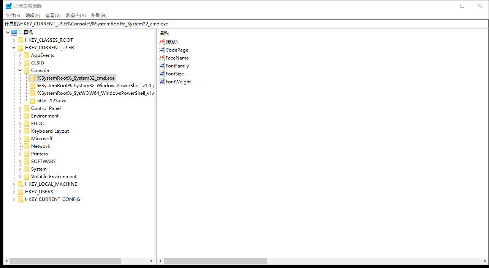

→选中→右键→删除。

##### cmd输入ASCII码

Alt+小键盘数字。

##### 编译链接

编译：翻译，
链接：打包，
程序优化方向：大小/速度。

编译一个c或cpp文件，生成一个obj文件，
链接多个obj文件，生成一个exe文件。

在c文件同目录下面，打开cmd。

使用cl命令编译（默认情况还会链接）程序，从c文件生成obj文件。

| 编译选项 | 说明                         |
| -------- | ---------------------------- |
| /c       | 仅编译不链接                 |
| /W[1~4]  | 设置警告等级，默认1级        |
| /WX      | 设置警告视为错误             |
| /P       | 生成预处理结果i文件          |
| /O1      | 减小体积                     |
| /O2      | 加快速度                     |
| /Od      | 禁用优化                     |
| /ZI      | 增加调试信息                 |
| /Zp      | 设置结构成员对齐值           |
| /Ob0     | 禁用内联                     |
| /Ob1     | 有inline关键字的函数尽量内联 |
| /Ob2     | 所有函数尽量内联             |

使用clink命令链接程序，从obj文件生成exe文件。

```
cl /c Hello.c
link Hello.obj
```

##### 微软C/C++编译器选项

离线文档。

##### 预处理语句

开头有#前缀，结尾没有;后缀。

包含文件。

```c
#include <库头文件名>
#include "自定义头文件名"
```

防止重复包含。

```c
#pragma once
```

定义宏，宏名是要搜索替换的文本。

```c
#define 要搜索替换的文本 替换的结果
```

条件编译。

```c
#ifdef 宏名

#endif // 宏名
```

##### printf函数

[C 库函数 – printf() | 菜鸟教程 (runoob.com)](https://www.runoob.com/cprogramming/c-function-printf.html)

[Format Specification Syntax: `printf` and `wprintf` Functions | Microsoft Docs](https://docs.microsoft.com/en-us/cpp/c-runtime-library/format-specification-syntax-printf-and-wprintf-functions?view=msvc-170)

```c
// 向控制台输出格式化字符串
// 成功返回输出字符串长度，失败返回负数
int printf(
    const char* format // 格式字符串地址
    [, argument]...	   // 参数
);

#include <stdio.h>
```

格式字符串。

```c
%[标志][宽度][.精度][大小]类型
```

| 类型 | 说明                                  |
| :--- | :------------------------------------ |
| u    | 4字节10进制无符号整数                 |
| d    | 4字节10进制有符号整数（不输出正号）   |
| x,X  | 4字节16进制无符号整数（不输出0x前缀） |
| p    | 地址（效果等于08X）                   |
| f    | 4字节10进制有符号小数                 |
| c    | 字符                                  |
| s    | 字符串                                |

```c
#include <stdio.h>
#include <stdlib.h>

int main()
{
    unsigned char uc = 0xFF;
    unsigned short usn = 0xFFFF;
    unsigned int un = 0xFFFFFFFF;
    unsigned long uln = 0xFFFFFFFF;
    unsigned long long ulln = 0xFFFFFFFFFFFFFFFF;

    char c = 0x7F;
    short sn = 0x7FFF;
    int n = 0x7FFFFFFF;
    long ln = 0x7FFFFFFF;
    long long lln = 0x7FFFFFFFFFFFFFFF;

    float f = 3.14;
    double d = 3.14;
    long double ld = 3.14;

    printf("%hhu\r\n", uc);	  // unsigned char
    printf("%hu\r\n", usn);	  // unsigned short
    printf("%u\r\n", un);	  // unsigned int
    printf("%lu\r\n", uln);	  // unsigned long
    printf("%llu\r\n", ulln); // unsigned long long

    printf("%hhd\r\n", c);	  // char
    printf("%hd\r\n", sn);	  // short
    printf("%d\r\n", n);	  // int
    printf("%ld\r\n", ln);	  // long
    printf("%lld\r\n", lln);  // long long

    printf("%f\r\n", f);	  // float
    printf("%lf\r\n", d);	  // double
    printf("%llf\r\n", ld);	  // long double

    system("pause");
    return 0;
}
```

通过隐式类型转换，【4字节类型符】也可以正确输出【1/2字节整型】。

因为【short的第1个字母s】和【输出字符串s】重复，所以选择【short的第2个字母h】，作为大小缩写。

------

.2设置小数点后保留2位数。

```c
#include <stdio.h>

printf("%.2f\r\n", 3.1415926);
```

3设置右对齐，占3位空间，空格补齐。

```c
#include <stdio.h>

printf("%3d\r\n", 12);
```

03设置右对齐，占3位空间，0补齐。

```c
#include <stdio.h>

printf("%03d\r\n", 12);
```

-3设置左对齐，占3位空间，空格补齐。

```c
#include <stdio.h>

printf("%-3dA\r\n", 12);
```

16进制输出内存，数组必须使用unsigned char类型。

```c
#include <stdio.h>
#include <stdlib.h>

int main()
{
    unsigned char sz[] = "Hello world!";

    for (int i = 0; i < sizeof(sz) / sizeof(sz[0]); i++)
    {
        printf("%02X ", sz[i]); // 48 65 6C 6C 6F 20 77 6F 72 6C 64 21 00
    }
    printf("\b\r\n");

    system("pause");
    return 0;
}
```

##### 菜鸟教程

[C 语言教程 | 菜鸟教程 (runoob.com)](https://www.runoob.com/cprogramming/c-tutorial.html)

##### MSDN

离线文档。

C库函数和WINAPI，不能确定哪个效率高。

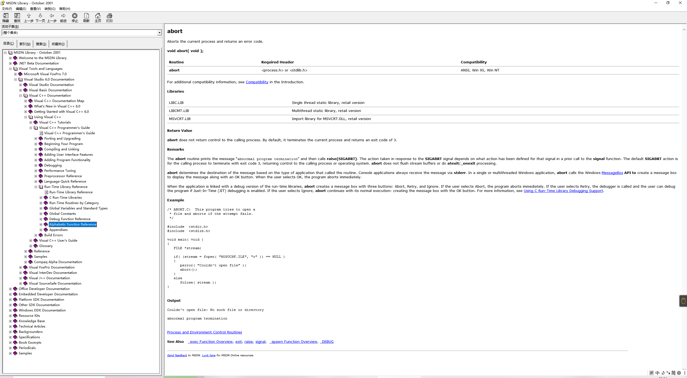

##### __int64l类型

VS2019的

long int是4字节整型，

long long和__int64是8字节整型。

```c
__int64 lln = 0x1234567812345678;
```

##### 常量的前缀后缀

| 前缀 | 说明      |
| ---- | --------- |
| 0b   | 2进制     |
| 0    | 8进制     |
|      | 10进制    |
| 0x   | 16进制    |
| L    | 2字节字符 |

| 后缀 | 说明                            |
| ---- | ------------------------------- |
| l    | 8字节整型常量                   |
| .f   | 4字节浮点常量，点后面可以接小数 |
| .    | 8字节浮点常量，点后面可以接小数 |
| .l   | 8字节浮点常量，点后面可以接小数 |

##### hpp扩展名

C++的头文件扩展名。

##### cmd切换历史指令

键盘的上下箭头。

##### cmd重定位

打开cmd，

使用>符号写文件。

```
Hello > Hello.txt
```

使用<符号读文件。

```
Hello < Hello.txt
```

##### fprintf函数

fprintf函数的第一个参数使用stdout，效果和printf函数相同。

```c
// 向流stream输出格式化字符串
// 成功返回输出字节数，失败返回负数
int fprintf(
    FILE* stream, 	   // FILE指针，stdin，stdout，stderr
    const char* format // 格式字符串地址
    [, argument]...	   // 参数
);

#include <stdio.h>
fprintf(stdin, "%d\r\n", n);
fprintf(stdout, "%d\r\n", n);
fprintf(stderr, "%d\r\n", n);
```

##### VC++6.0只能在作用域开头定义变量

##### srand和rand函数

rand函数生成固定的随机数序列。

srand只需要在开头调用一次，不能循环调用。

```c
// 设置随机起点
void srand(
    unsigned int seed // 生成随机数的种子
);

// 获取系统时间
// 返回秒数
time_t time(
    time_t* timer // 存放秒数的地址
);

// 生成伪随机数
// 返回一个伪随机数
int rand(void);

#include <stdlib.h>
#include <time.h>
srand((unsigned)time(NULL));
rand()
```

实现在RAND.C文件。

```c
int __cdecl rand (
        void
        )
{
#ifdef _MT // 多线程版

        _ptiddata ptd = _getptd();

        return( ((ptd->_holdrand = ptd->_holdrand * 214013L
            + 2531011L) >> 16) & 0x7fff );

#else  /* _MT */ // 单线程版
        return(((holdrand = holdrand * 214013L + 2531011L) >> 16) & 0x7fff);
    // holdrand是一个全局变量，初值1
    // holdrand乘常量，加常量，右移16位，保留低位
    
#endif  /* _MT */
}
```

```c
void __cdecl srand (
        unsigned int seed
        )
{
#ifdef _MT // 多线程版

        _getptd()->_holdrand = (unsigned long)seed;

#else  /* _MT */ // 单线程版
        holdrand = (long)seed;
    // 使用参数赋值holdrand变量
    
#endif  /* _MT */
}
```

##### bat编译脚本

为了防止意外，不使用删除。

```
cl /c /W3 /WX Test.c
link Test.obj
Test.exe
```

原版。

```
del *.exe
del *.obj
cl /c /W3 /WX Test.c
link Test.obj
pause
Test.exe
```

##### 观察内存

```c
#include <stdio.h>
#include <stdlib.h>

int main()
{
    int n = 0x12345678;

    printf("%p\r\n", &n); // 0019FEDC
    scanf("%d", &n);

    system("pause");
    return 0;
}
```

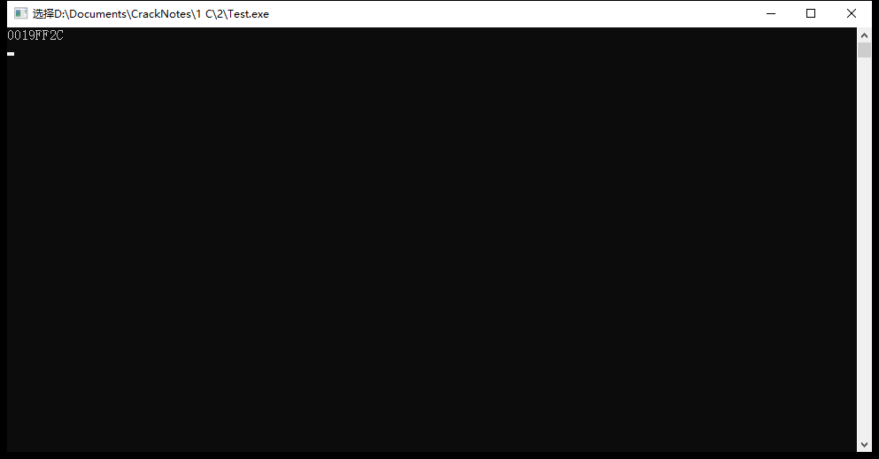

##### 暂停程序

```c
#include <stdlib.h>

system("pause");
```

##### VS2019设置基址

项目→属性→C/C++→高级→基址。

##### VS2019设置随机基址

项目→属性→链接器→高级→随机基址。

只随机前4位。

##### WinHex查看进程内存

打开RAM→选中进程→全部内存→确定→Alt+G→新地址→确定。

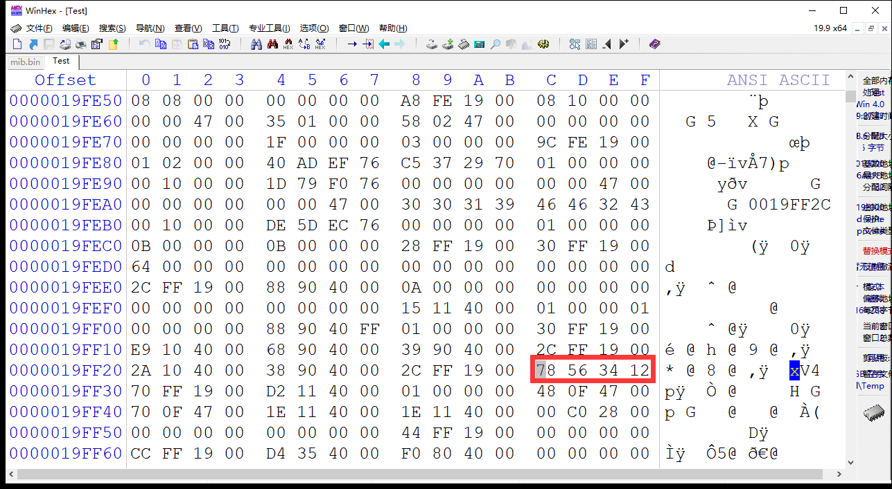

滚动滚轮刷新内存数据。

删除的数据残留在内存里，新数据直接覆盖删除的数据。

##### WinHex

```
文件
	新建
	打开
	保存Ctrl+S
	另存为

编辑
	撤销Ctrl+Z
	剪切（切除选中内容，选中内容存入剪切板）
	复制选块（选中内容存入剪切板）
		正常
			Hello world!
		十六进制数据
			48656C6C6F20776F726C642100000000
		编辑器显示
			Offset      0  1  2  3  4  5  6  7    8  9 10 11  12 13 14 15
			00000000   48 65 6C 6C  6F 20 77 6F  72 6C 64 21  00 00 00 00   Hello world!    
		GREP Hex
			\x48\x65\x6C\x6C\x6F\x20\x77\x6F\x72\x6C\x64\x21\x00\x00\x00\x00
		C 源码
			unsigned AnsiChar data[16] = {
				0x48, 0x65, 0x6C, 0x6C, 0x6F, 0x20, 0x77, 0x6F, 0x72, 0x6C, 0x64, 0x21, 0x00, 0x00, 0x00, 0x00
			};
		Pascal 源码
			data: array[0..15] of byte = (
				$48, $65, $6C, $6C, $6F, $20, $77, $6F, $72, $6C, $64, $21, $00, $00, $00, $00
			);
	剪切板数据
		粘贴（在光标之前挤入剪切板数据）
		写入（从光标开始覆盖剪切板数据）
	移除Del（切除选中内容）
	粘贴0字节（扩容，覆盖0x00）
	定义选块（当前位置是光标位置）
		开始
		结束/文件大小（可以设置选块结束位置或选块长度定义选块）
	全选Ctrl+A
	清除选块（取消选中，而不是移除选块内容）
	转换选块（选块加密解密、转换大小写、转换字符集）
	修改数据
		添加（选块加法）
		反向字节的顺序_字节（选块每_字节回文）
		左移一位（选块的二进制值左移，不会移出选块范围）
		右移一位（选块的二进制值右移，不会移出选块范围）
		根据...移_字节（选块内容复制到相对选块开始偏移_字节位置）
		反转位（取反）
		XOR（异或）
		OR（或）
		AND（与）
	填充选块
		填充十六进制数值（选块覆盖十六进制数值）
		随机字符
		覆盖次数（可以多次填充）

搜索
	查找文本
	查找十六进制数值
	替换文本（可以挤入或覆盖）
	替换十六进制数值（可以挤入或覆盖）
	整数数值（小尾方式存储的十进制数）
	浮点数值（小尾方式存储的十进制数）
	搜索文本段落（搜索连续的字母、数字、标点符号和空格）
	继续搜索F3（显示下个结果）

导航
	转到偏移量（跳转）
	移动选块（移动选中范围，而不是移动选块内容）

查看
	字符集 No.1（显示第一个字符集）
	字符集 No.2（显示第二个字符集）
	显示
		数据解释器（选块内容按照小尾方式转换为十进制数）

工具
	打开磁盘
	打开RAM
		显示进程名和进程ID，点击进程名显示模块名，点击全部内容打开整个进程，点击模块名打开这个模块
	十六进制转换（十六进制数和十进制数互相转换）
	比较（比较文件）
	分析选块（显示选块数值分布）
	计算哈希值

选项
	数据解释器（设置数据解释器）

帮助
	设置
		中文
```

##### 存储姓名字符串缓冲区大小

大于等于32字节。

##### 大端小端

从左到右，
内存是从低地址到高地址，
数字是从高位到低位。

4字节16进制整型值0x12345678在大端和小端下的存放方式，
小端：78 56 34 12，高位在高地址，
大端：12 34 56 78，高位在低地址。

2字节16进制整型值0x1234在小端下的存放方式，
小端：34 12 00 00，【小于4字节的类型】按照【4字节】对齐内存。

##### scanf函数和正则表达式

```c
// 从控制台输入格式化字符串
// 成功返回接收字段数，失败返回0
int scanf(
    const char* format // 格式字符串地址
    [, argument]...    // 参数
);

#include <stdio.h>
```

格式字符串。

```c
%[标志][宽度][.精度][大小]类型
```

格式字符串的类型必须精确匹配变量大小。

------

输入之后，必须清空输入缓冲区。

```c
#include <stdio.h>

rewind(stdin);
```

必须检查输入，使用正则表达式限制scanf函数的输入内容，如果不满足条件，就截断字符串。

只能输入数字0到9。

```c
#include <stdio.h>

char sz[16] = { 0 };
scanf("%[0-9]s", sz);
rewind(stdin);
printf("%s\r\n", sz);
```

只能输入数字0或9。

```c
#include <stdio.h>

char sz[16] = { 0 };
scanf("%[0,9]s", sz);
rewind(stdin);
printf("%s\r\n", sz);
```

不能输入数字0。

```c
#include <stdio.h>

char sz[16] = { 0 };
scanf("%[^0]s", sz);
rewind(stdin);
printf("%s\r\n", sz);
```

输入长度只能小于等于15。

```c
#include <stdio.h>

char sz[16] = { 0 };
scanf("%15s", sz);
rewind(stdin);
printf("%s\r\n", sz);
```

**（备忘）只能输入字母数字空格，长度小于等于15。**

```c
#include <stdio.h>

char sz[16] = { 0 };
scanf("%15[' ',0-9,A-Z,a-z]s", sz);
rewind(stdin);
printf("%s\r\n", sz);
```

##### 整型溢出漏洞

向【2字节整型变量】存入【4字节整型值】，会溢出覆盖【2字节整型变量后面2字节内存】。

```c
short int n = 0;
scanf("%d", &n);
```

如果【2字节整型变量后面2字节内存】存储了【pascal字符串开头的字符串长度】，就可以通过整型溢出修改存储的字符串长度，输入超过字符串缓冲区大小的内容，超过字符串缓冲区的内容可以覆盖函数指针，修改程序执行流程。

##### VS2019设置SDL检查

项目→属性→C/C++→常规。

##### VS2019设置安全检查

（GS）防止栈溢出，栈溢出可以覆盖函数的返回地址、异常处理程序地址、某些类型的参数。

##### %求模运算

求模结果符号和被除数相同。

```
a / b = q余r
r = a - q * b
```

```c
#include <stdio.h>
#include <stdlib.h>

int main()
{
    printf("%d\r\n", 10 % 3);   // 1
    printf("%d\r\n", 10 % -3);  // 1
    printf("%d\r\n", -10 % 3);  // -1
    printf("%d\r\n", -10 % -3); // -1

    system("pause");
    return 0;
}
```

可以使用除法去掉某位右面的位，使用取模去掉某位左面的位。

##### 类型大小

1bit（比特）有1位2进制数，
1byte（字节）有8位2进制书，4位16进制数。

```
0b XXXX XXXX
0x    X    X
```

| 类型               | 字节大小 |
| ------------------ | -------- |
| WORD               | 2        |
| DWORD              | 4        |
| QWORD              | 8        |
| unsigned char      | 1        |
| unsigned short     | 2        |
| unsigned int       | 4        |
| unsigned long      | 4        |
| unsigned long long | 8        |
| char               | 1        |
| short              | 2        |
| int                | 4        |
| long               | 4        |
| long long          | 8        |
| float              | 4        |
| double             | 8        |
| long double        | 8        |

##### 类型转换

整型转换浮点，可能丢失精度，整型有8/16/32/64位有效数字，浮点有24/53位有效数字，
浮点转换整型，舍弃小数保留整数，丢失精度。

修改Test的类型和值，查看输出。

```c
#include <stdio.h>
#include <stdlib.h>

int main()
{
    unsigned char Test = 0xAA;

    unsigned char uc = Test;
    unsigned short usn = Test;
    unsigned int un = Test;
    unsigned long uln = Test;
    unsigned long long ulln = Test;

    char c = -Test;
    short sn = -Test;
    int n = -Test;
    long ln = -Test;
    long long lln = -Test;

    float f = Test;
    double d = Test;
    long double ld = Test;

    printf("%hhu\r\n", uc);	  // unsigned char
    printf("%hu\r\n", usn);	  // unsigned short
    printf("%u\r\n", un);	  // unsigned int
    printf("%lu\r\n", uln);	  // unsigned long
    printf("%llu\r\n", ulln); // unsigned long long

    printf("%hhd\r\n", c);	  // char
    printf("%hd\r\n", sn);	  // short
    printf("%d\r\n", n);	  // int
    printf("%ld\r\n", ln);	  // long
    printf("%lld\r\n", lln);  // long long

    printf("%f\r\n", f);	  // float
    printf("%lf\r\n", d);	  // double
    printf("%llf\r\n", ld);	  // long double

    system("pause");
    return 0;
}
```

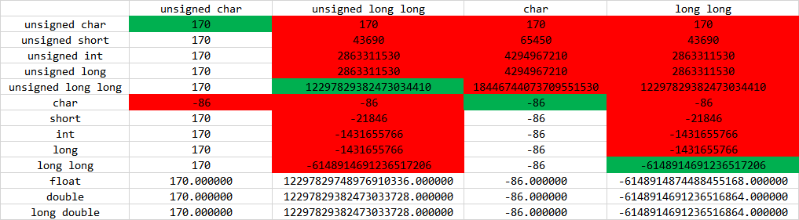

不会出错的转换方式，
无符号整型→更长的整型，
有符号整型→更长的有符号整型，
其他转换方式在有效数字位数长了之后都会出错。

------

前两种是把值取出来转换,
第三种是把【地址上的值】解释为浮点。

**（备忘）**
**转换操作前后的值相等，二进制不同。**
**解释操作前后的二进制相同，值不同。**

```c
#include <stdio.h>
#include <stdlib.h>

int main()
{
    int n = 0x12345678;
    float fA = n;
    float fB = (float)n;
    float fC = *(float*)&n;

    printf("%p\r\n", &n);  // 0019FEDC 78 56 34 12
    printf("%p\r\n", &fA); // 0019FED0 b4 a2 91 4d
    printf("%p\r\n", &fB); // 0019FEC4 b4 a2 91 4d
    printf("%p\r\n", &fC); // 0019FEB8 78 56 34 12

    // 8: 	int n = 0x12345678;
    // 00411938 C7 45 F8 78 56 34 12 mov         dword ptr[n], 12345678h
    // 9: 	float fA = n;
    // 0041193F F3 0F 2A 45 F8       cvtsi2ss    xmm0, dword ptr[n]
    // 00411944 F3 0F 11 45 EC       movss       dword ptr[fA], xmm0
    // 10: 	float fB = (float)n;
    // 00411949 F3 0F 2A 45 F8       cvtsi2ss    xmm0, dword ptr[n]
    // 0041194E F3 0F 11 45 E0       movss       dword ptr[fB], xmm0
    // 11: 	float fC = *(float*)&n;
    // 00411953 F3 0F 10 45 F8       movss       xmm0, dword ptr[n]
    // 00411958 F3 0F 11 45 D4       movss       dword ptr[fC], xmm0

    system("pause");
    return 0;
}
```

##### 进制转换

###### 2→16

【4位2进制数】组合成【1位16进制数】。

```
0b 0001 0010 0011 0100 0101 0110 0111 1000
0x    1    2    3    4    5    6    7    8
```

###### 16→2

【1位16进制数】展开成【4位2进制数】。

```
0x    1    2    3    4    5    6    7    8
0b 0001 0010 0011 0100 0101 0110 0111 1000
```

###### 2/16→10

按权展开相加。

###### 10→2/16

10进制数123.375转换为2进制数。

整数部分使用除基取余法。

被除数（要转换的数）/除数（基数，也就是要转换的进制）=商……余数，之后每次计算出的商再当被除数，除到商为0结束。

先除出的余数是转换结果的低位，手工计算操作是，从下往上复制，从左往右粘贴。

| 除数 |    被除数     |     余数     |
| :--: | :-----------: | :----------: |
|  2   |    **123**    |              |
|  2   | =123/2=**61** | =123%2=**1** |
|  2   | =61/2=**30**  | =61%2=**1**  |
|  2   | =30/2=**15**  | =30%2=**0**  |
|  2   |  =15/2=**7**  | =15%2=**1**  |
|  2   |  =7/2=**3**   |  =7%2=**1**  |
|  2   |  =3/2=**1**   |  =3%2=**1**  |
|  2   |  =1/2=**0**   |  =1%2=**1**  |

整数部分是1111011。

------

小数部分使用乘基取整法。

被乘数（要转换的数）*乘数（基数，也就是要转换的进制）=积，如果积>=1，积=积-1，之后每次计算出的积再当被乘数，乘到积为0结束。

先乘出的整数是转换结果的高位，手工计算是，从上往下复制，从左往右粘贴。

| 乘数 | 被乘数 | 积是否大于等于1 |
| :--: | :----: | :-------------: |
|  2   | 0.375  |                 |
|  2   |  0.75  |        0        |
|  2   |  0.5   |        1        |
|  2   |   0    |        1        |

小数部分是011。

------

转换结果是0b1111011.011。

##### Windows计算器

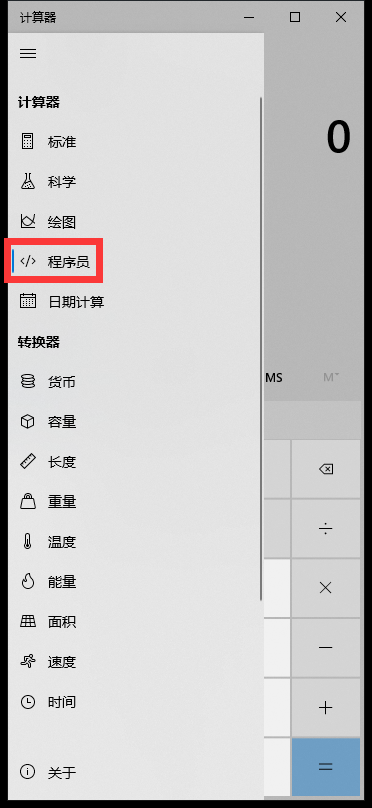

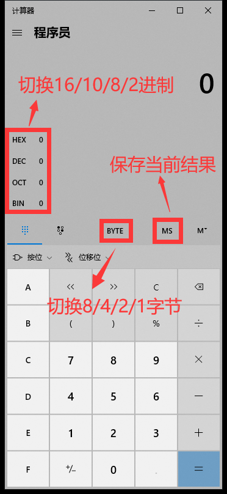

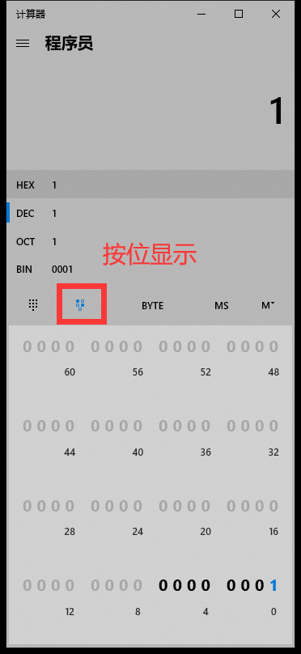

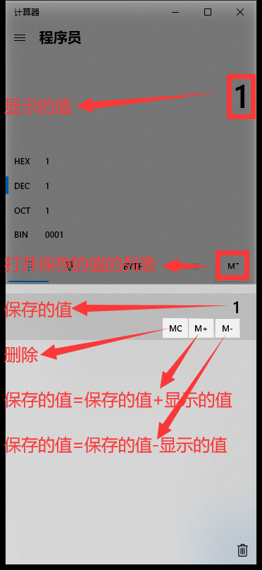

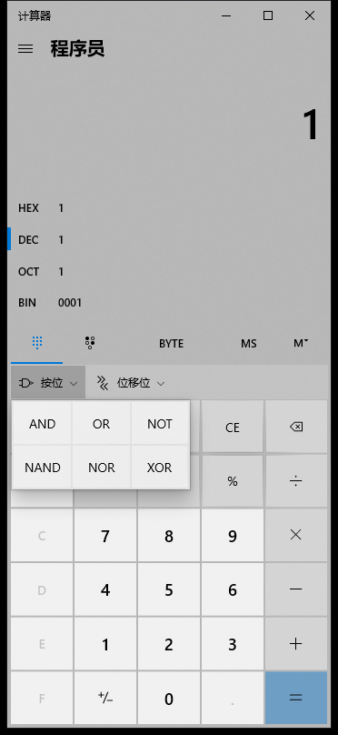

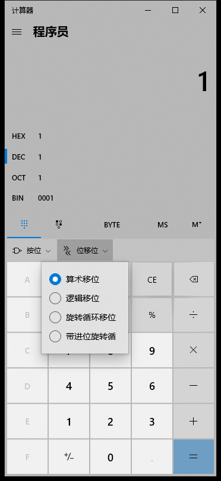

##### 移位

逻辑移位：左右移补0。

算术移位：左移补0，右移补符号位。

旋转循环移位和带进位旋转循环移位。

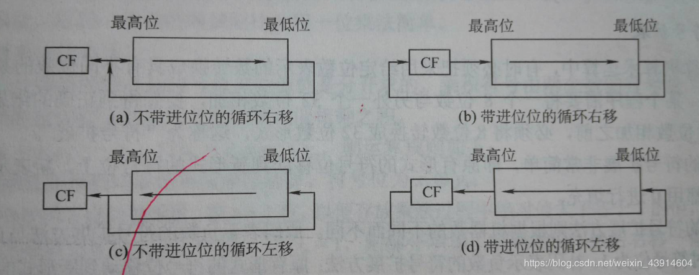

##### IEEE754浮点数

###### float

```
SEEEEEEE EDDDDDDD DDDDDDDD DDDDDDDD
值 = (-1) ^ S * 2 ^ (E - 127) * 1.D
```

2进制数1111011.011转换为float类型。

```
1111011.011
(-1) ^ 0 * 2 ^ (133 - 127)×1.111011011
0100 0010 1111 0110 1100 0000 0000 0000
   4    2    F    6    C    0    0    0
42 F6 C0 00 
00 C0 F6 42
```

```c
#include <stdio.h>
#include <stdlib.h>

int main()
{
    float f = 123.375;

    printf("%p\r\n", &f);

    system("pause");
    return 0;
}
```

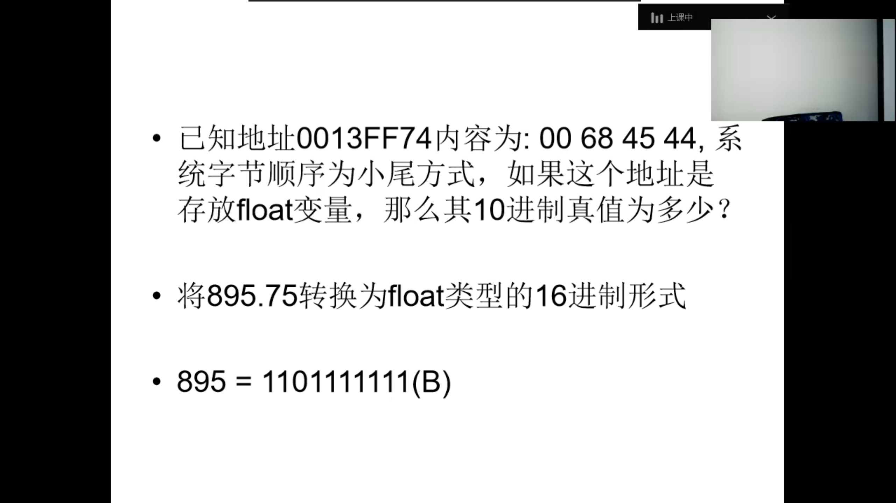

```
00 68 45 44
44 45 68 00
   4    4    4    5    6    8    0    0
0100 0100 0100 0101 0110 1000 0000 0000
0 10001000 100010101101
(-1) ^ 0 * 2 ^ (136 - 127) * 1.100010101101
1100010101.101
789.625
```

```
895.75
1101111111.11
(-1) ^ 0 * 2 ^ (136 - 127) * 1.10111111111
0 10001000 10111111111
0100 0100 0101 1111 1111 0000 0000 0000
   4    4    5    F    F    0    0    0
44 5F F0 00
00 F0 5F 44
```

###### double

S有1位，E有11位，D有52位。

##### 无符号数原码反码补码

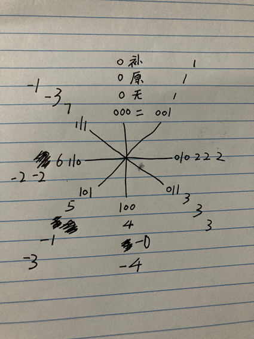

在n位二进制数最高项等于0时，

```
无符号数解析结果 = 原码解析结果 = 补码解析结果
```

在n位二进制数最高项等于1时，

```
原码解析结果 = 2 ^ (n - 1) - 无符号数解析结果 = 刻度数量的一半 - 无符号数解析结果
补码解析结果 = 无符号数 - 2 ^ n = 无符号数解析结果 - 刻度数量
```

###### 原码求补码

正数不变，负数除符号位外各位取反整体加一。

###### neg求补运算

正负数都是各位取反整体加一。

补码求补运算之后得到相反数。

###### 推导过程

```
负数的原码沿着逆时针方向转半圈 = 该负数的相反数
负数的补码沿着顺时针方向到0的距离 = 负数的绝对值
```

使用补码可以把减法转化为加法，在时钟图中-1的效果和+7相同，使用+7替代-1。

##### 减法→加法

1字节16进制数A和B相减。

```
A - B
= A + (0x100 - B) - 0x100
= A + negB - 0x100
= A + negB
```

```
B + ~B = 0xFF
B + ~B + 1 = 0x100
~B + 1 = 0x100 - B
~B + 1 = negB
negB = ~B + 1
```

##### 乘法→加法和移位

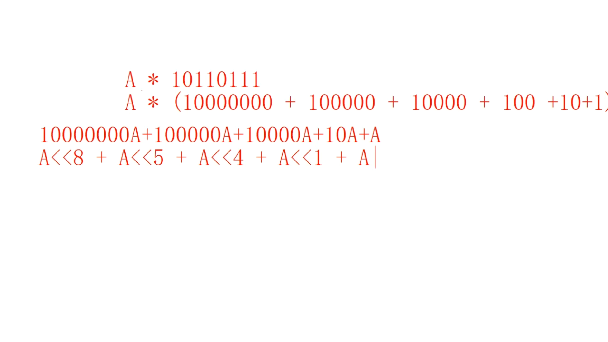

##### 除法→乘法和移位

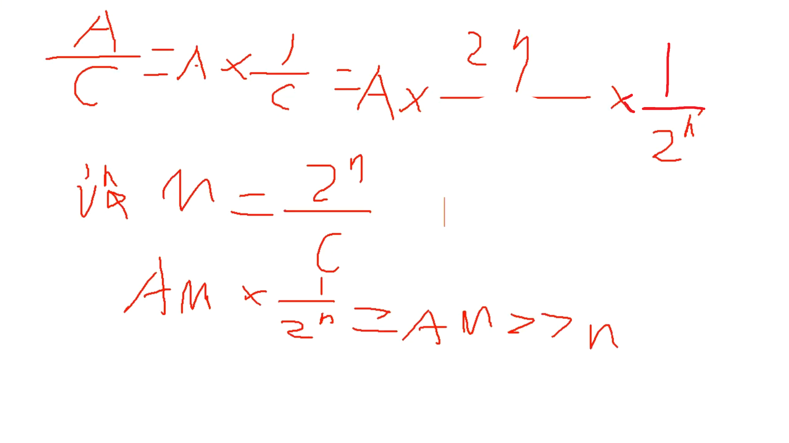

##### C历史

作者Dennis Ritchie（丹尼斯里奇）使用C编写UNIX系统。

ANSI（美国国家标准化协会）制订了ANSI C标准。

##### 流程图

##### VC++6.0新建C控制台项目

File→New→Projects→Win32 Console Application→修改Project name和Location→OK→A "Helio, World!"' application.→Finish→OK。

##### VC++6.0界面

View。

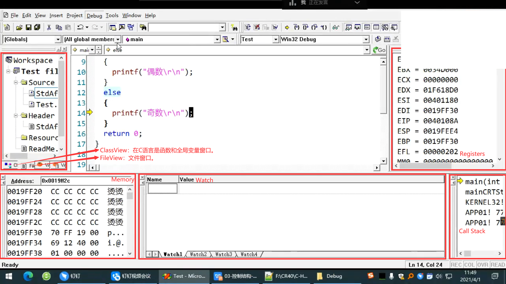

设置内存窗口数据，内存窗口显示长度。

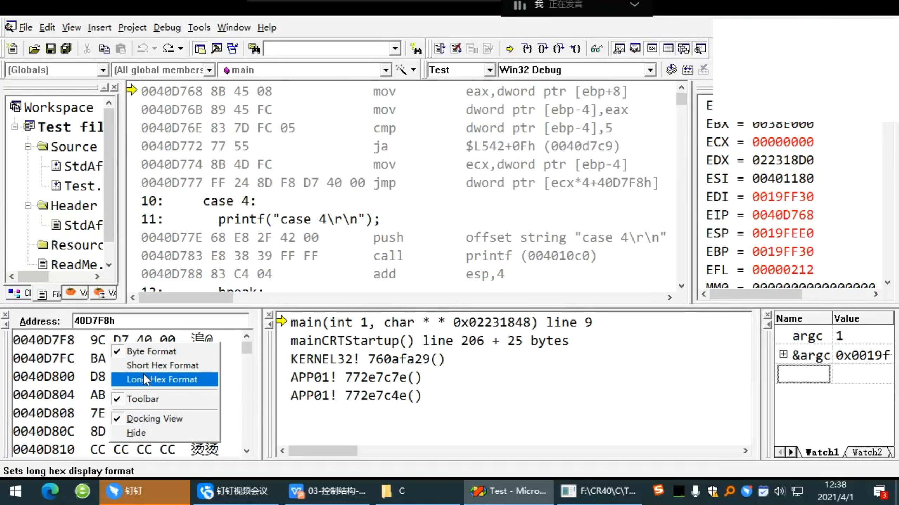

##### VC++6.0设置tab→空格

Tools→Qptions→Tabs→Insert spaces。

不同代码编辑器会把tab解释为不同数量的空格，为了在不同代码编辑器中保持代码缩进一致，直接使用空格替换tab。

##### VS2019设置

工具→选项→键盘→应用以下其他键盘映射方案→Visual C++ 6。

​                   →字体和颜色→字体(粗体表示等宽字体)→YaHei Consolas Hybrid，雅黑字体。

​                                                                                       →**（备忘）Consolas**，控制台字体方便校正代码识图结果。

​                   →文本编辑器→C/C++→行号。

​                                                         →制表符→制表符→制表符大小→4。

​                                                                                        →缩进大小→4。

​                                                                                        →插入空格。

##### VS2019项目的属性

Debug或Release，x86，使用多字节，关闭SDL，关闭随机基址。

在程序入口点中main函数描述项目干什么。

项目生成的可执行文件在Debug、Release、x64文件夹，这三个文件夹可以删除。

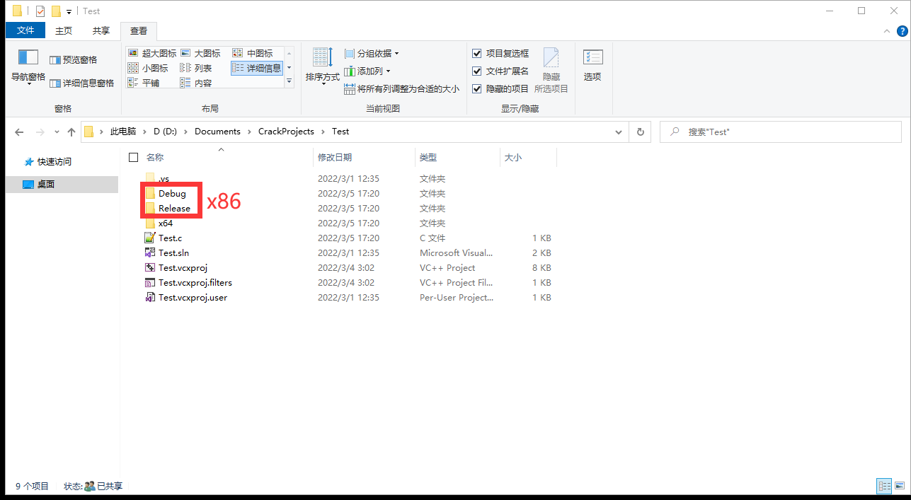

##### VS2019快捷键

| 快捷键        | 意义         |
| ------------- | ------------ |
| Ctrl+U        | 小写选中字母 |
| Ctrl+Shift+F5 | 大写选中字母 |
| Ctrl+K+D      | 自动对齐     |
| Alt+鼠标      | 选中竖行     |

##### IDE

（Integrated Development Environment，集成开发环境）代码编辑器+编译器+链接器+调试器+版本控制工具。

##### VC++6.0快捷键

| 快捷键        | 意义         |
| ------------- | ------------ |
| /             | 注释         |
| F7            | 编译链接     |
| F9            | 断点         |
| F5            | 运行         |
| F10           | 单步跳过     |
| F11           | 单步进入     |
| F12           | 查看定义     |
| Shift+F11     | 跳出         |
| Alt+8         | 打开反汇编   |
| Ctrl+F7       | 仅编译不链接 |
| Ctrl+F5       | 不调试运行   |
| Shift+F5      | 停止调试     |
| Ctrl+Shift+F5 | 重新调试     |
| Ctrl+F10      | 运行到光标   |

##### if语句

我的经验是所有分支条件互斥，可能性大的分支放在前面。

好的写法，2个if分支条件互斥，else表示剩余情况。

```c
if (n > 100)
{
    printf("n > 100\r\n");
}
else if (n == 100)
{
    printf("n == 100\r\n");
}
else
{
    printf("n < 100\r\n");
}
```

坏的写法，第2个if分支条件实际是n > 90&& n <= 100，造成逻辑混乱。

```c
if (n > 100)
{
    printf("n > 100\r\n");
}
else if(n > 90)
{
    printf("n > 90\r\n");
}
else
{
    printf("n <= 90\r\n");
}
```

##### switch-case语句

使用数组做表，case值当作数组下标，【case分支的语句的地址】当作数组值。

如果有default，就在【数组[跳过去的case值]】中填上【default分支的语句的地址】，

如果没有default，就填上【switch-case语句结束之后的语句的地址】。

其他实现方式的原理见后面逆向课。

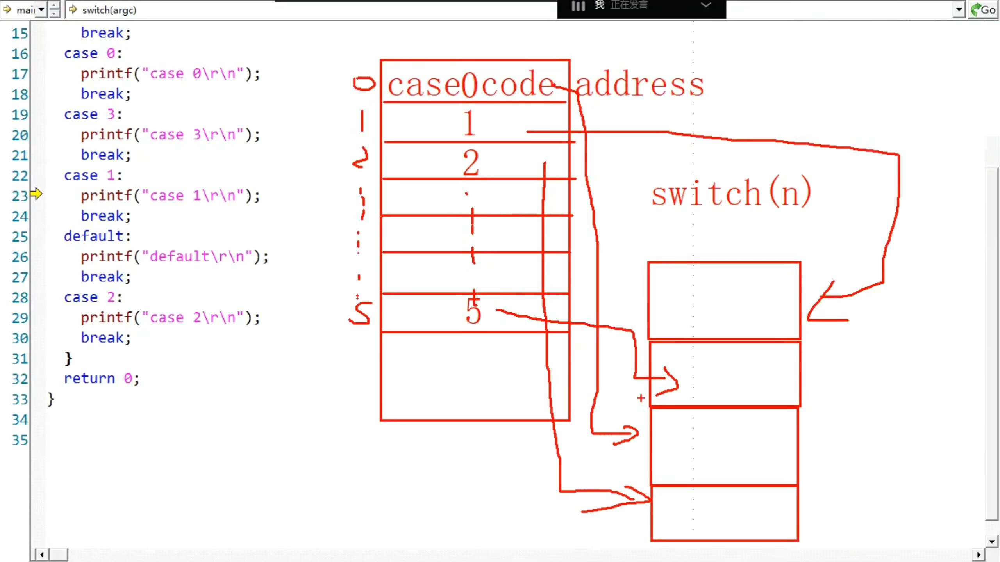

case值只能是整数。

如果没有break，就一直向下执行。

打乱case顺序不会影响效率。

如果所有case的结尾都有break，那么default的位置可以随便放。

##### 控制台画图形

定义一个二维数组a[y]\[x]当作屏幕，x当作x坐标，y当作y坐标，画y=f(x)函数的曲线。

```c
#include <stdio.h>
#include <stdlib.h>

#define Y 16
#define X 16
#define BLACK 0
#define WHITE 1

int main()
{
    // 屏幕数组
    char ac[Y][X] = { BLACK };

    // 循环赋值
    for (int y = 0; y < Y; y++)
    {
        for (int x = 0; x < X; x++)
        {
            if (y == x)
            {
                ac[y][x] = WHITE;
            }
        }
    }

    // 循环显示
    for (int y = 0; y < Y; y++)
    {
        for (int x = 0; x < X; x++)
        {
            if (ac[y][x] == BLACK)
            {
                printf("  ");
            }
            else
            {
                printf("■"); // 字符■输出是一个正方形
            }
        }
        printf("\r\n");
    }

    system("pause");
    return 0;
}
```

##### 循环语句

3种循环都使用jxx指令实现，原理见后面逆向课。

迭代变量使用int类型，不使用size_t类型，size_t类型会导致<0判断结果永假。

注意使用==运算符判断相等，而不是=运算符。

break和continue语句。

##### goto语句

只在跳出多重循环和模拟异常处理时使用goto语句。

##### 内存属性

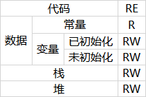

##### 函数栈结构

堆栈只是栈，和堆没关系。

函数栈从下往上，从高地址向低地址生长。

栈顶指向有效数据。

| 函数栈结构           | 寄存器        |
| -------------------- | ------------- |
| 保存的寄存器2的值    | ←被调方的栈顶 |
| 保存的寄存器1的值    |               |
| 局部变量2            |               |
| 局部变量1            |               |
| 调用方栈底的地址     | ←被调方的栈底 |
| 返回调用方代码的地址 |               |
| 参数1                |               |
| 参数2                |               |

##### 函数调用过程

1.按调用约定传参，栈传递表示在栈上保存。

2.在栈上保存返回调用方代码的地址。

3.执行流程转移到被调方代码。

4.在栈上保存调用方栈底的地址。

5.更新栈底到被调函数。

6.在栈上为局部变量申请空间。

在Debug版，预留的局部变量空间>=局部变量空间总和。如果编译选项有/Zi+/Od，那么局部变量空间初始化为0xCC。

在Release版，预留的局部变量空间<=局部变量空间总和，不同时使用的局部变量共用栈空间。

7.在栈上保存寄存器环境。

在Debug版，保存12字节。

在Release版，看情况。

8.执行函数体。

烫：未初始化栈空间。

屯铪葺：未初始化堆空间。

9.从栈上恢复寄存器环境。

10.释放局部变量空间。

11.恢复调用方的栈底。

12A.__cdecl约定，取出返回地址，转换执行流程，由调用方清理释放内存空间。

12B.\__stdcall和__fastcall约定，取出返回地址，由被调方清理释放内存空间，转换执行流程。

------

可以通过main函数参数识别main函数。

《设计模式》。

##### 调用约定

调用方（caller）和被调方（callee）需要约定以下内容，

参数的传递方向，

参数的传输媒介，

返回值的位置。

谁负责释放参数空间（caller和callee有且仅有一方去做）。

```c
返回值类型 调用约定 函数名(形参类型 形参名)
{
    函数体;
}
```

| 调用约定                         | 参数的传递方向 | 参数的传输媒介                          | 返回值的位置 | 谁负责释放参数空间 |
| -------------------------------- | -------------- | --------------------------------------- | ------------ | ------------------ |
| __cdecl（C约定，国标）           | 从右到左       | 栈                                      | 寄存器       | 调用方             |
| __stdcall（标准调用约定，微软）  | 从右到左       | 栈                                      | 寄存器       | 被调方             |
| __fastcall（快速调用约定，微软） | 从右到左       | 左起前2个参数通过寄存器，其余参数通过栈 | 寄存器       | 被调方             |

```c
void __cdecl FunA()
{
    ;
}

void __stdcall FunB()
{
    ;
}

void __fastcall FunC()
{
    ;
}
```

##### VC++6.0设置调用约定

Project→Settings→C/C++→Category→Code Generation→Calling convention。

##### VS2019设置调用约定

项目→属性→C/C++→高级→调用约定。

##### 递归

使用循环解决线性问题，使用递归解决非线性问题。

解决父问题需要先解决子问题，子问题和父问题是同样的事，子问题更为简单。

解决父问题，相当于调用递归函数。

解决子问题，相当于在递归函数中调用递归函数，传入不一样的参数。

递归函数不能无限次的调用自己，需要有出口，简化为非递归情况。

递归函数体被二次调用分割，二次调用之前的代码在递归前进段中执行，二次调用之后的代码在递归返回段中执行。

使用递归方法求斐波那契数列（Fibonacci sequence，黄金分割数列）。

```c
#include <stdio.h>
#include <stdlib.h>

#define MaxFibN 46

int GetFib(int n)
{
    if (n >= 3)
    {
        return GetFib(n - 1) + GetFib(n - 2);
    }
    else
    {
        return 1;
    }
}

int main()
{
    for (int i = 1; i <= MaxFibN; i++)
    {
        printf("%2d %10d\r\n", i, GetFib(i));
    }

    system("pause");
    return 0;
}
```

循环方法。

```c
#include <stdio.h>
#include <stdlib.h>

#define MaxFibN 46

int GetFib(int n)
{
    int a = 1, b = 1, c = 1;

    for (int i = 3; i <= n; i++) // i是项数，第1/2项不需要计算直接输出1
    {
        c = a + b;
        a = b;
        b = c;
    }

    return c;
}

int main()
{
    for (int i = 1; i <= MaxFibN; i++)
    {
        printf("%2d %10d\r\n", i, GetFib(i));
    }

    system("pause");
    return 0;
}
```

##### 走迷宫

递归写法。

```c
#include <stdio.h>
#include <stdlib.h>

#define Y 16
#define X 16
#define BLANK 0
#define WALL 1
#define WAY_1 2
#define WAY_2 3
#define EXIT 4

// 迷宫数组
char g_acMaze[Y][X] = {
    1,1,1,1,1,1,1,1,1,1,1,1,1,1,1,1,
    1,0,1,1,0,0,0,0,0,1,0,0,0,0,0,1,
    1,0,0,1,0,1,0,1,1,1,1,1,0,1,0,1,
    1,0,1,0,0,1,0,0,0,1,0,1,0,0,1,1,
    1,0,1,1,0,1,0,1,0,0,0,1,0,1,0,1,
    1,0,0,0,0,1,0,1,1,1,0,1,0,0,0,1,
    1,0,1,0,1,1,0,0,0,1,0,1,0,1,1,1,
    1,0,0,0,0,1,0,1,0,0,0,0,0,0,0,1,
    1,0,1,1,0,1,0,1,1,1,0,1,0,1,1,1,
    1,0,0,0,0,1,0,0,0,0,0,1,0,0,0,1,
    1,1,0,1,1,1,1,1,1,1,1,1,1,1,0,1,
    1,0,0,0,0,1,0,1,1,1,0,1,0,0,0,1,
    1,0,1,1,0,0,0,0,0,1,0,1,0,1,0,1,
    1,0,0,0,0,1,0,1,0,0,0,1,0,1,0,1,
    1,0,0,1,0,1,0,1,1,1,0,1,0,0,4,1,
    1,1,1,1,1,1,1,1,1,1,1,1,1,1,1,1,
};

// 显示迷宫
void ShowMaze()
{
    system("cls");
    for (int y = 0; y < Y; y++)
    {
        for (int x = 0; x < X; x++)
        {
            if (g_acMaze[y][x] == BLANK)
            {
                printf("  ");
            }
            else if (g_acMaze[y][x] == WALL)
            {
                printf("■"); // 字符■输出是一个正方形
            }
            else if (g_acMaze[y][x] == WAY_1)
            {
                printf("○");
            }
            else if (g_acMaze[y][x] == WAY_2)
            {
                printf("●");
            }
            else
            {
                printf("★");
            }
        }
        printf("\r\n");
    }
}

// 走迷宫
// nX 人的X坐标
// xY 人的Y坐标
void Maze(int nX, int nY)
{
    if (g_acMaze[nX][nY] == EXIT)
    {
        g_acMaze[nX][nY] = WAY_1;
        ShowMaze();
        printf("成功到达出口\r\n");

        system("pause");
        exit(0);
    }

    g_acMaze[nX][nY] = WAY_1;
    ShowMaze();
    system("pause");

    if (g_acMaze[nX + 1][nY] == BLANK || g_acMaze[nX + 1][nY] == EXIT)//右
    {
        Maze(nX + 1, nY);
    }
    if (g_acMaze[nX][nY + 1] == BLANK || g_acMaze[nX][nY + 1] == EXIT)//下
    {
        Maze(nX, nY + 1);
    }
    if (g_acMaze[nX - 1][nY] == BLANK || g_acMaze[nX - 1][nY] == EXIT)//左
    {
        Maze(nX - 1, nY);
    }
    if (g_acMaze[nX][nY - 1] == BLANK || g_acMaze[nX][nY - 1] == EXIT)//上
    {
        Maze(nX, nY - 1);
    }

    g_acMaze[nX][nY] = WAY_2;
    ShowMaze();
    system("pause");

    return;
}

int main()
{
    Maze(1, 1);

    return 0;
}
```

循环写法，使用队列遍历图。

##### 控制台清屏

```c
#include <stdlib.h>

system("cls");
```

##### 退出程序

```c
#include <stdlib.h>

exit(0);
```

##### 查看二维地图

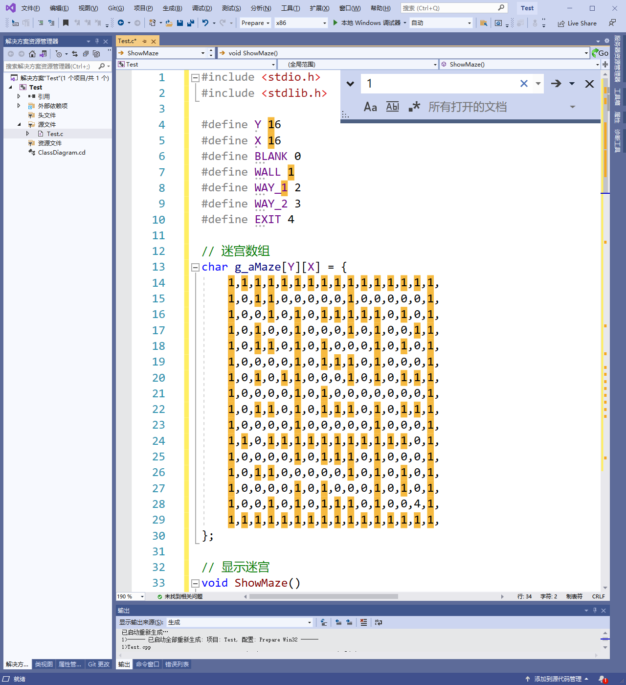

##### 函数规范

```c
/*
函数功能
参数意义
返回值意义
备注
版本 修改日期 修改人
*/
```

##### 数组

同类（数据类型相同，业务功能相同）数据的集合。

###### 一维数组

```c
类型 数组名[元素个数] = { 初始化列表 };
```

```c
int an[5] = { 1,2,3,4,5 };
```

元素个数是一个常量，如果有初始化列表，那么元素个数可以省略。

```c
int an[] = { 1,2,3,4,5 };
```

**（备忘）数组元素全部初始化为0。**

```c
int an[5] = { 0 };
```

数组元素前面初始化为1,2，后面全部初始化为0。

```c
int an[5] = { 1,2 };
```

下标访问公式。

```c
type a[X];
a[i] = *((int)a + sizeof(type) * i)
```

数组名的值是数组开头地址，
数组名的地址还是数组开头地址，
虽然数组名可以当作【一个总是指向数组开头地址的指针常量】，但是这个指针并没有分配内存空间，对这个指针取地址结果还是数组开头地址。

------

数组名当作指针常量参与运算，sizeof(数组名)得到数组大小。

###### 二维数组

下标访问公式。

```c
type a[Y][X];
a[i][j]
= *((int)a + sizeof(type[X]) * i + sizeof(type) * j)
= *((int)a + sizeof(type) * (X * i + j))
```

二维数组的元素是一维数组。

```c
#include <stdio.h>
#include <stdlib.h>

int main()
{
    int an[3][5] = { 0 };

    printf("%d\r\n", sizeof(an[0])); // 20，是一维数组的大小

    system("pause");
    return 0;
}
```

###### 数组传参

传入的是数组开头地址，函数声明不需要写元素个数。

```c
返回值类型 函数名(数组类型 数组形参名[]);
```

数组形参名是指针，sizeof(数组形参名)得到指针大小。

调用方的数组名是常量不能++，被调方的数组名是变量可以++。

```c
#include <stdio.h>
#include <stdlib.h>

void Fun(int an[])
{
	printf("%d\r\n", sizeof(an)); // 4，数组形参名是指针，sizeof(数组形参名)得到指针大小
	an++; // 被调方的数组名是变量可以++。
}

int main()
{
	int an[5] = { 0 };

	printf("%d\r\n", sizeof(an)); // 20
	// an++; // 报错，error C2105: “++”需要左值，调用方的数组名是常量不能++

	Fun(an);

	system("pause");
	return 0;
}
```

###### 遍历数组

```c
int an[5] = { 1,2,3,4,5 };
for (int i = 0; i < sizeof(an) / sizeof(an[0]); i++)
{
    printf("%d\r\n", an[i]);
}
```

##### 排序算法

考虑数值分布情况、数据结构（数组或链表）、存储媒介（内存或磁带）。

内存可以随机访问（直接访问任意位置），

磁带只能顺序访问（只能从头往后访问），在顺序访问的情况下冒泡排序效率高。

数组下标访问效率，0>1>其他。

##### 选择排序

想要按照【从左到右从小到大顺序】排列【一列混乱排列的数字】。

左面的数字完成了排序，右面的数字正在排序。

每次遍历右面的数字，找出最小值，交换最小值和【右面的数字里最左面的数字】。

一直这样操作，直到右面的数字只剩一个。

##### 折半查找

想要从【从左到右从小到大顺序排列的一列数字】中查找一个数字。

每次比较【查找的数字】和【数列中间的数字】，【数列中间的数字】把数列分割成左右2个子数列，如果小于就保留左面的数列，如果大于就保留右面的数列，如果等于就找到了。

一直这样操作，直到没有可以比较的数字。

------

折半计算，L或R不能直接等于M，需要多挪动一点。如果直接等于M，在L和R相差1的时候，L = M，M = (L + R) / 2 = L（整型向0取整），进入死循环。

```
L = M + 1 或 R = M - 1
M = (L + R) / 2
```

##### 字符和256位ASCII码

**（备忘）1字节字符。**

```c
char d = 'A';
char cB = '\x41';
```

2字节字符加L前缀。

```c
unsigned short int wc = L‘A’;
```

常用ASCII码。

| 10进制 | 16进制 | 字符    |
| ------ | ------ | ------- |
| 8      | 08     | 退格 \b |
| 9      | 09     | tab \t  |
| 10     | 0A     | 换行 \n |
| 13     | 0D     | 回车 \r |
| 32     | 20     | 空格    |
| 48     | 30     | 0       |
| 65     | 41     | A       |
| 97     | 61     | a       |

字符■输出是1个正方形，不能使用%c输出，只能直接输出。

```c
printf("■");
```

在某些系统下\n功能是\r+\n，在某些系统下\n功能只是\n，使用\r\n保证在所有系统下都能回车换行。

##### VS2019设置字符集

项目→属性→高级→高级属性→字符集。

##### 字符串

###### C语言字符串

数据+字符串结束符。

适合实时传输。

变量名sz前缀，表示0结尾的C字符串。

**（备忘）字符串前面初始化为ABC，后面全部初始化为0。**

```c
char sz[5] = "ABC";
```

字符串可以写成多行。

```c
#include <stdio.h>
#include <stdlib.h>

int main()
{
    char sz[] = 
        "Hello world!\r\n"
        "Hello world!\r\n"
        "Hello world!\r\n";

    printf("%s", sz);

    system("pause");
    return 0;
}
```

字符串前面初始化为ABC，后面不确定。

```c
char sz[5] = { "ABC" };
```

字符串前面初始化为ABC，后面全部初始化为0。

```c
char sz[5] = { "ABC\0" };
```

2字节字符串L前缀，前面初始化为ABC，后面全部初始化为0。

```c
unsigned short int sz[5] = L"ABC";
```

根据字符大小使用不同的字符串函数。

------

使用2字节字符输出中文，需要设置地区。

```c
#include <locale.h>
#include <stdio.h>
#include <stdlib.h>

int main()
{
    // setlocale设置地区
    // LC_ALL改变地区影响的所有东西
    // "chs"简体中文
    setlocale(LC_ALL, "chs");
    wprintf(L"%s\r\n", L"啊");

    system("pause");
    return 0;
}
```

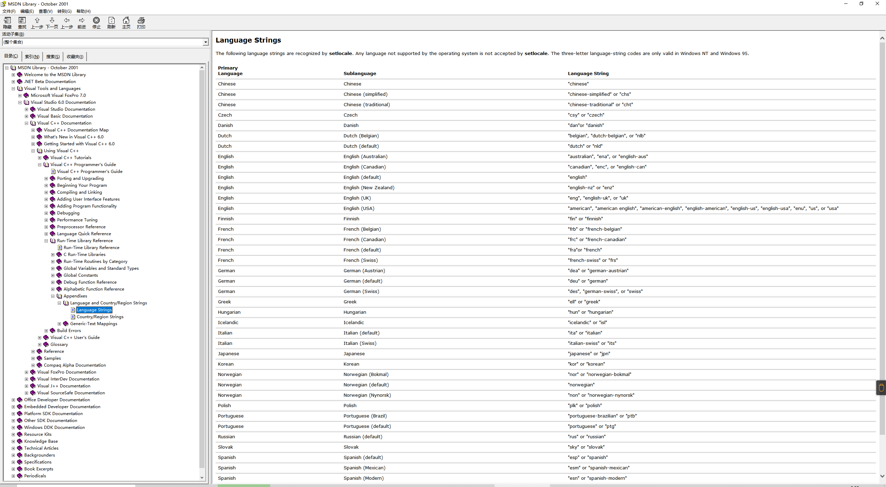

###### pascal字符串

字符串长度+数据。

适合按照固定格式传输，访问不定长字符串效率高。

变量名str前缀，表示不知道是什么风格字符串。

###### 微软内核字符串

字符串长度+数据+字符串结束符。

##### 其他输入输出函数

```c
// 从控制台输入一个字符
// 成功返回输入的字符，失败返回EOF
int getchar(void);

// 向控制台输出一个字符
// 成功返回输出的字符，失败返回EOF
int putchar(
    int c
);

// 从控制台输入一行字符串
// 成功返回字符串地址，失败返回NULL
// 遇到换行停止，不检查长度，有安全漏洞
char* gets(
    char* buffer // 字符串地址
);

// 从控制台输出一行字符串
// 成功返回非负数，失败返回EOF
// 自动输出换行
int puts(
    const char* string // 字符串地址
);

#include <stdio.h>
getchar();
putchar(c)
gets(buffer)
puts(string);
```

##### str和mem函数

[C 标准库 –  | 菜鸟教程 (runoob.com)](https://www.runoob.com/cprogramming/c-standard-library-string-h.html)

标准库不检查指针。

```c
// 复制内存
// 返回目标内存地址
// 没有考虑源内存和目标内存重叠的情况
void* memcpy(
    void* dest, 	 // 目标内存地址
    const void* src, // 源内存地址
    size_t count	 // 复制大小
);

// 复制内存
// 返回目标内存地址
// 考虑了源内存和目标内存重叠的情况。
void* memmove(
    void* dest, 	 // 目标内存地址
    const void* src, // 源内存地址
    size_t count	 // 复制大小
);

// 获取字符串长度，不包含\0
// 返回字符串长度
size_t strlen(
    const char* string // 字符串地址
);

// 比较字符串
// 返回ASCII码差值
int strcmp(
    const char* string1, // 字符串1地址
    const char* string2	 // 字符串2地址
);

// 复制字符串
// 返回目标字符串地址
char* strcpy(
    char* strDestination, // 目标字符串地址
    const char* strSource // 源字符串地址
);

// 追加字符串
// 返回目标字符串地址
char* strcat(
    char* strDestination, // 被追加字符串地址
    const char* strSource // 追加字符串地址
);

// 字母转小写
// 返回字符串地址
char* strlwr(
    char* string // 字符串地址
);

// 字母转大写
// 返回字符串地址
char* strupr(
    char* string // 字符串地址
);

// 查找子串
// 成功返回子串在父串的地址，失败返回NULL
// 如果子串长度为0，返回父串地址
char* strstr(
    const char* string,    // 被查找的父串地址
    const char* strCharSet // 要查找的子串地址
);

#include <string.h>
memcpy(dest, src, count)
memcpy(dest, src, count)
strlen(string)
strcmp(string1, string2)
strcpy(strDestination, strSource)
strcat(strDestination, strSource)
strlwr(string)
strupr(string)
strstr(string, strCharSet)
```

##### 二维字符串做表

直接使用字符串需要写12个printf。

使用二维字符串做表，数组下标可以像switch-case语句一样，当作分支结构使用。

```c
#include <stdio.h>
#include <stdlib.h>

int main()
{
    char pszMonth[12][16] = { "January","February","March","April","May","June","July","August","September","October","November","December" };
    int nMonth = 0;

    printf("输入数字查询月份英文\r\n");

    scanf("%d", &nMonth);
    rewind(stdin);
    if (nMonth < 1 || nMonth > 12)
    {
        printf("输入错误\r\n");
        return -1;
    }

    printf("%d月是%s", nMonth, pszMonth[nMonth]);

    system("pause");
    return 0;
}
```

##### 计算字符串中单词数

自动机原理。

```c
#include <stdio.h>
#include <stdlib.h>

int IsSplit(char c)
{
    char acSplit[] = { '\t','\n','\r',' ','.',',' };
    for (int i = 0; i < sizeof(acSplit); i++)
    {
        if (acSplit[i] == c)
        {
            return 1;
        }
    }
    return 0;
}

int main()
{
    char sz[] = "123 456\n789\t789\rqwe,rty.uio";
    int nIsWord = 0, nCount = 0;

    for (int i = 0; i < strlen(sz); i++)
    {
        if (nIsWord == 0) // 不在单词中
        {
            if (IsSplit(sz[i])) // 是分隔符
            {
            }
            else // 不是分隔符
            {
                // 进入单词
                nIsWord = 1;
                nCount++;
            }
        }
        else // 在单词中
        {
            if (IsSplit(sz[i])) // 是分隔符
            {
                // 退出单词
                nIsWord = 0;
            }
            else // 不是分隔符
            {
            }
        }
    }

    printf("%d\r\n", nCount);

    system("pause");
    return 0;
}
```

##### TIM屏幕识图CV代码

粘贴到VS2019，VS2019设置控制台字体。

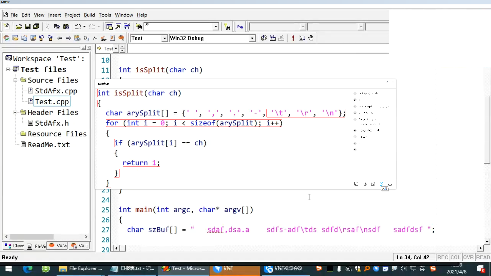

##### 贪吃蛇

（GluttonousSnake）

如何设计使得代码通用【C、C++、C++SDK、16位汇编】4个版本。

main.c文件是程序入口，调用游戏类，游戏类有地图类，地图类有食物类和蛇类。

地图类成员变量【地图二维数组】、【食物类对象】、【蛇类对象】。

食物类成员变量【食物位置结构体】

蛇类成员变量【蛇位置结构体数组】，结构体成员有nX、nY、nToHead，nToHead指向头部方向的下一节身体，【蛇头指针（数组下标）】、【蛇尾指针（数组下标）】、【蛇长度】、【蛇前进方向】。

【游戏类成员函数】调用【地图类成员函数】初始化墙，写进地图数组。

【游戏类成员函数】调用【食物类成员函数】生成食物，在地图空余位置大小范围里（地图大小-墙大小-蛇长度）随机食物位置，写进地图数组。

【游戏类成员函数】调用【蛇类成员函数】初始化蛇，随机蛇位置，写进蛇数组，写进地图数组。

【游戏类成员函数】调用【地图类成员函数】显示地图。

【游戏类成员函数】，循环检测按键和定时器（有按键或定时器，检查【按键方向】和【蛇前进方向】（相反，进行下一轮循环），根据【按键方向】修改【蛇前进方向】，判断蛇是否可以移动、吃食物、会死亡（调用对应【蛇类成员函数】），进入下一轮循环）。

蛇移动，不修改整个蛇数组，而是把尾部移向头部前面。

```c
// nToHead指向头部方向的下一节身体
// 通过【头部的指针】和【尾部的指针】访问【头部】和【尾部】
地图上蛇尾部 = 空白;
地图上蛇头部前面 = 蛇;

尾部的XY = 头部前面的XY;
头部的nToHead = 尾部下标;

头部的指针 = 尾部的指针;
尾部的指针 = 尾部的nToHead;
```

蛇吃食物，直接在食物上生成新头部，判断获胜（是，跳转到游戏获胜流程），重新生成食物。

蛇死亡跳转到游戏失败流程。

##### 检测按键函数

```c
#include <stdio.h>
#include <conio.h>
#include <stdlib.h>

#define TIME_INTERVAL 1000

int main()
{
    while (1)
    {
        if (_kbhit() != 0) // 有键盘输入
        {
            printf("输入了%c\r\n", _getch()); // 输出输入字符
        }
    }

    system("pause");
    return 0;
}
```

##### 检测定时器函数

```c
#include <time.h>
#include <stdio.h>
#include <stdlib.h>

#define TIME_INTERVAL 1000

int main()
{
    clock_t lnStart = 0; // 计时开始时间
    clock_t lnNow = 0;   // 现在时间

    lnStart = clock(); // 计时开始
    while (1)
    {
        lnNow = clock(); //刷新现在时间

        if (lnNow - lnStart >= TIME_INTERVAL) // 触发定时器
        {
            printf("定时器\r\n");

            lnStart = lnNow; // 刷新计时开始时间
        }
    }

    system("pause");
    return 0;
}
```

##### 检查错误

**（备忘）好的写法，条件错误就返回。**

```c
int* pA = NULL, *pB = NULL;

if (pA != NULL)
{
    return -1;
}
if (pB != NULL)
{
    return -1;
}
*pA = *pB;

return 0;
```

坏的写法，条件正确才执行，这样会越套越多。

```c
int* pA = NULL, *pB = NULL;

if (pA != NULL)
{
    if (pB != NULL)
    {
        *pA = *pB;
        return 0;
    }
}

return -1;
```

##### 变量

###### 全局变量

在编译期间，全局变量导出外部符号，在链接期间寻找全局变量定义，如果找不到就报错显示无法解析的外部命令。

生命期从模块载入到模块卸载。

------

在h文件声明变量。

```c
#pragma once
#include <stdio.h>
#include <stdlib.h>

// 声明全局变量
extern int g_n;

void Fun();
```

在一个c文件中定义变量，所有c文件包含一个h头文件。

```c
#include "Test.h"

// 输出全局变量
void Fun()
{
    printf("%X\r\n", g_n);

    return;
}
```

在另一个c文件中使用变量，所有c文件包含一个h头文件。

```c
#include "Test.h"

int g_n = 0x12345678;

// 测试全局变量
int main()
{
    Fun();

    system("pause");
    return 0;
}
```

已初始化的全局变量，在可执行文件中分配空间保存值。

未初始化的全局变量，可执行文件只记录所有未初始化全局变量大小，加载之后才分配空间。

```c
#include <stdlib.h>
#include <string.h>
#include <stdio.h>

char g_szA[0x1000] = "Hello world!\r\n"; // 已初始化的全局变量，注释后会改变exe文件大小
char g_szB[0x1000]; // 未初始化的全局变量，注释后不会改变exe文件大小

int main()
{
    system("pause");
    return 0;
}
```

在C++可以使用函数初始化全局变量，在main函数之前的_cinit函数，运行初始化函数。

```c++
#include <stdlib.h>
#include <time.h>
#include <stdio.h>

int g_n = rand();

int main()
{
    srand((unsigned)time(NULL)); // 在初始化函数rand之后运行，没有起效

    printf("%p %X\r\n", &g_n, g_n); // 0041B140 29

    system("pause");
    return 0;
}
```

\_cinit的第1个\_initterm初始化官方变量，第2个\_initterm遍历函数指针，函数初始化全局变量。

F2和F1是代理函数，F1包函数参数和返回值，F2包函数之间的运算（比如1个全局变量初始化需要调用2个函数）。

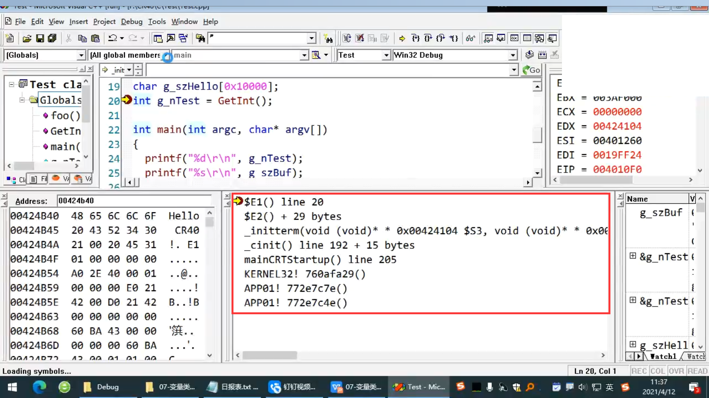

###### 静态全局变量

单文件的全局变量。

不导出外部符号。

编译器限制。

###### 静态局部变量

单函数的全局变量。

使用全局变量记录是否初始化，实现静态局部变量只初始化一次。

在C++可以使用函数初始化静态局部变量。

VS2019在静态局部变量附近的内存位置存放初始化标记，0表示未初始化，多线程有安全问题。

```c++
#include <stdlib.h>
#include <stdio.h>

void fun(int n)
{
    static int sn = n;
    printf("%p\r\n", &sn);
    printf("%d\r\n", sn);
    (&sn)[1] = 0; // 修改静态局部变量初始化标志
}

int main()
{
    fun(1);
    fun(2);

    system("pause");
    return 0;
}

// 0041A14C
// 1
// 0041A14C
// 2
```

使用名称粉碎，变量名增加变量的作用域信息。

编译器限制。

###### 函数传值

被调方修改【传入的值】，不改变【调用方的值】。

###### 函数传地址

被调方修改【传入的地址本身】，不改变【调用方的地址】。被调方修改【地址指向的值】，同步改变调用方。

###### 局部变量

生命期从函数调用开始到函数调用结束。

严禁返回局部变量和参数变量的地址。

###### 寄存器变量

变量存放在寄存器里，加快运算速度。

Debug版不使用。

Release版自动使用。

##### 命名规范

匈牙利命名法：作用域_类型+名字。

| 作用域   | 缩写 |
| -------- | ---- |
| 全局     | g    |
| 静态全局 | sg   |
| 静态局部 | sl   |
| 函数参数 | p    |
| 局部变量 | l    |
| 成员变量 | m    |

| 类型          | 缩写   |
| ------------- | ------ |
| point         | p      |
| array         | a      |
| unsigned      | u      |
| bool          | b      |
| char          | c      |
| short int     | sn     |
| int           | n      |
| long int      | ln     |
| long long int | lln    |
| float         | f      |
| double        | d      |
| long double   | ld     |
| string        | str    |
| C string      | sz     |
| struct        | tagXxx |
| tagXxx        | xxx    |
| class         | CXxx   |
| CXxx          | xxx    |
| union         | unXxx  |
| unXxx         | xxx    |
| Functon       | fn     |
| word          | w      |
| dword         | dw     |
| qword         | qw     |

##### VC++6.0二进制编辑器

File→Open→文件类型→所有文件→选中exe文件→Open as→Binary→打开。

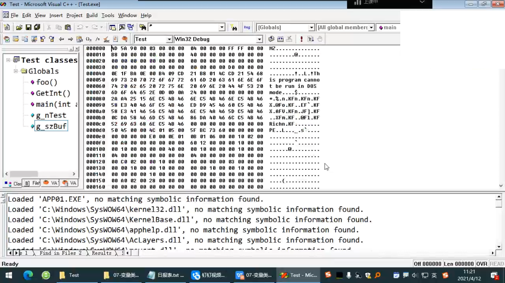

##### VS2019重新生成

生成→重新生成解决方案。

解决某些奇怪的问题。

##### 模块基址

可执行文件装载在内存中的位置。

##### 内联函数

函数像宏一样展开。

是否内联和编译选项、函数复杂度有关。

Debug版不使用，

Release版尽量使用。

在头文件声明并定义函数。

**（备忘）所有必须写在头文件的函数定义都是因为需要在编译期找到这个函数定义。**

```c
#pragma once
#include <stdio.h>

inline void Fun(int n)
{
    printf("%X\r\n", n);
}
```

调用函数。

```c
#include "Test.h"

int main()
{
    Fun(0x12345678);
    return 0;
}
```

##### 代理函数

想要使用【函数指针】遍历【函数指针数组】，运行函数。

因为每个函数的参数和返回值不同，所以不能使用一个函数指针运行所有函数。

每个函数都各自生成一个无参无返回值的代理函数，在代理函数中调用函数。

使用函数指针遍历代理函数指针数组，运行函数。

##### 名称粉碎

变量名增加变量的信息。

##### 宏

```c
#define 搜索的文本 替换的结果
```

###### 语法

从宏定义到文件结束，扫描文件，依次替换一次文本。

```c
QWE
#define QWE ASD
QWE
```

```c
QWE // 在宏定义上面，没有替换

ASD // 在宏定义上面，替换了
```

不会替换字符串的文本。

```c
#define QWE ASD
QWE
char sz[] = "QWE";
```

```c
ASD
char sz[] = "QWE";
```

替换后的内容可以有空格。

```c
#define QWE ASD ZXC
QWE
```

```c
ASD ZXC
```

多次替换。

```c
QWE
#define QWE ASD
QWE
#define ASD ZXC
QWE
```

```c
QWE // 没有替换

ASD // 替换1次

ZXC // 替换2次
```

###### 符号宏

使用符号替代数字，意义明确，可以统一修改。

```c
#define PI 3.14
```

###### 编译选项宏

使用【预处理条件编译语句】判断宏是否定义，决定是否编译。

最好在编译选项组里定义宏，而不是在代码中。切换编译选项组后宏消失，不用手动注释宏定义语句。

```c
#define _DEBUG

#ifdef _DEBUG

#endif // _DEBUG
```

###### 兼容宏

VC++6.0的for语句没有单独的作用域，使用if语句包裹for语句，增加一层作用域。

```c
#include <stdlib.h>
#include <stdio.h>

#define for if(1)for

int main()
{
    for (int i = 0; i < 5; i++)
    {
        printf("Hello world!\r\n");
    }

    for (int i = 0; i < 5; i++)
    {
        printf("Hello world!\r\n");
    }

    system("pause");
    return 0;
}
```

```c
#include <stdlib.h>
#include <stdio.h>

#define for if(1)for

int main()
{
    if (1)
    {
        for (int i = 0; i < 5; i++)
        {
            printf("Hello world!\r\n");
        }
    }

    if (1)
    {
        for (int i = 0; i < 5; i++)
        {
            printf("Hello world!\r\n");
        }
    }

    system("pause");
    return 0;
}
```

微软的兼容宏。

```c
#define INT int
```

有些关键字被取消了，使用宏替换被取消的关键字。

```c
#define near
#define fear
```

###### 说明宏

```c
#define IN
#define OUT
```

###### 编译器内部宏

_MSC_VER是编译器版本，判断编译器版本宏，决定是否使用新特性。

```c
#if _MSC_VER > 1000
#pragma once
#endif // _MSC_VER > 1000
```

输出程序信息，定位错误，全路径可能造成信息泄露。

```c
__FILE__     // 文件全路径
__FUNCTION__ // 函数名
__LINE__     // 行号
```

###### 防止重复包含宏

判断头文件有没有定义宏，决定是否包含。

```c
#ifdef MY_HEADER
#define MY_HEADER 

// 头文件内容

#endif // MY_HEADER
```

高版本可以直接使用预处理语句防止重复包含。

```c
#pragma once
```

###### 表达式宏

使用括号防止运算优先级导致的错误。

```c
#define GET_CIRCLE_AREA(r) ((r)*(r)*3.14)
```

#转字符串。

```c
#define STRING(s) #s

int main()
{
    char sz[] = STRING(Hello world!\r\n);

    return 0;
}
```

```c
int main()
{
    char sz[] = "Hello world!\r\n";

    return 0;
}
```

##连接字符串，实现泛型。

一个DEC→多个不同类型的DEF→每个DEF展开成函数定义。

一个调用名→函数名。

```c
#include <stdio.h>
#include <stdlib.h>

// 一种函数名生成多种函数
// 函数之间参数数量相同，返回值数量相同
// 展开后，第一个宏参数当作类型，第二个宏参数当作名称后缀
// 不需要修改
#define DEC(FUN) \
DEF_##FUN(char, char);\
DEF_##FUN(unsigned char, unsigned_char);\
DEF_##FUN(short, short);\
DEF_##FUN(unsigned short, unsigned_short);\
DEF_##FUN(int, int);\
DEF_##FUN(unsigned int, unsigned_int);\
DEF_##FUN(long, long);\
DEF_##FUN(unsigned long, unsigned_long);\
DEF_##FUN(float, float);\
DEF_##FUN(double, double);

// 不同函数的定义
// 函数之间参数可以不同，返回值可以不同
// 需要自己写
#define DEF_MAX(typeA, typeB) \
typeA max_##typeB(typeA x, typeA y)\
{\
    return x>y?x:y;\
}
#define DEF_MIN(typeA, typeB) \
typeA min_##typeB(typeA x, typeA y, typeA z)\
{\
    return (x<y?x:y)<z?x:z;\
}

// 宏替换后生成函数定义
// 需要自己写
DEC(MAX);
DEC(MIN);

// 调用语句转换成函数定义
// 需要自己写
#define FUN_MAX(type) max_##type
#define FUN_MIN(type) min_##type

int main()
{
    printf("%d\r\n", FUN_MAX(int)(11111111, 22222222));
    printf("%d\r\n", FUN_MAX(unsigned_int)(11111111, 22222222));
    printf("%f\r\n", FUN_MAX(float)(2.71828f, 3.14f));
    printf("%f\r\n", FUN_MAX(double)(2.71828, 3.14));

    printf("%d\r\n", FUN_MIN(int)(11111111, 22222222, 33333333));
    printf("%d\r\n", FUN_MIN(unsigned_int)(11111111, 22222222, 33333333));
    printf("%f\r\n", FUN_MIN(float)(2.71828f, 3.14f, 0.618f));
    printf("%f\r\n", FUN_MIN(double)(2.71828, 3.14, 0.618));

    system("pause");
    return 0;
}
```

```c
char max_char(char x, char y){ return x>y?x:y;};unsigned char max_unsigned_char(unsigned char x, unsigned char y){ return x>y?x:y;};short max_short(short x, short y){ return x>y?x:y;};unsigned short max_unsigned_short(unsigned short x, unsigned short y){ return x>y?x:y;};int max_int(int x, int y){ return x>y?x:y;};unsigned int max_unsigned_int(unsigned int x, unsigned int y){ return x>y?x:y;};long max_long(long x, long y){ return x>y?x:y;};unsigned long max_unsigned_long(unsigned long x, unsigned long y){ return x>y?x:y;};float max_float(float x, float y){ return x>y?x:y;};double max_double(double x, double y){ return x>y?x:y;};;
char min_char(char x, char y, char z){ return (x<y?x:y)<z?x:z;};unsigned char min_unsigned_char(unsigned char x, unsigned char y, unsigned char z){ return (x<y?x:y)<z?x:z;};short min_short(short x, short y, short z){ return (x<y?x:y)<z?x:z;};unsigned short min_unsigned_short(unsigned short x, unsigned short y, unsigned short z){ return (x<y?x:y)<z?x:z;};int min_int(int x, int y, int z){ return (x<y?x:y)<z?x:z;};unsigned int min_unsigned_int(unsigned int x, unsigned int y, unsigned int z){ return (x<y?x:y)<z?x:z;};long min_long(long x, long y, long z){ return (x<y?x:y)<z?x:z;};unsigned long min_unsigned_long(unsigned long x, unsigned long y, unsigned long z){ return (x<y?x:y)<z?x:z;};float min_float(float x, float y, float z){ return (x<y?x:y)<z?x:z;};double min_double(double x, double y, double z){ return (x<y?x:y)<z?x:z;};;

int main()
{
    printf("%d\r\n", max_int(11111111, 22222222));
    printf("%d\r\n", max_unsigned_int(11111111, 22222222));
    printf("%f\r\n", max_float(2.71828f, 3.14f));
    printf("%f\r\n", max_double(2.71828, 3.14));

    printf("%d\r\n", min_int(11111111, 22222222, 33333333));
    printf("%d\r\n", min_unsigned_int(11111111, 22222222, 33333333));
    printf("%f\r\n", min_float(2.71828f, 3.14f, 0.618f));
    printf("%f\r\n", min_double(2.71828, 3.14, 0.618));

    system("pause");
    return 0;
}
```

###### 代码段宏

代码段宏可以使用续行符。

```c
#include <stdlib.h>
#include <stdio.h>

#define PRINTF_STRING(s) \
printf(s);\
printf("\r\n");

int main()
{
    for (int i = 0; i < 5; i++)
    {
        PRINTF_STRING("Hello world!");
    }

    system("pause");
    return 0;
}
```

代码段宏是多行代码，在【没有使用花括号作为循环体的循环】后面衔接代码段宏会导致循环体错误。

```c
#include <stdlib.h>
#include <stdio.h>

#define PRINTF_STRING(s) \
printf(s);\
printf("\r\n");

int main()
{
    for (int i = 0; i < 5; i++)
        PRINTF_STRING("Hello world!");
    // 输出Hello world!Hello world!Hello world!Hello world!Hello world!
    // 因为printf("\r\n");没有进入循环体，所以没有换行

    system("pause");
    return 0;
}
```

##### VC++6.0设置编译选项组

Build→Configuration→Add→修改Configuration（编译选项组名字）→OK→选中刚才新建的编译选项组→Project→Settings→C/C++→Project Options→增加编译选项。

##### VS2019生成预处理文件

项目→属性→C/C++→预处理器→预处理到文件→是。

##### VC++6.0设置宏

Project→Settings→C/C++→Preprocessor definitions→逗号分隔，增加宏。

##### GUID

（全球唯一标识符）Win+R→打开→guidgun→确定。

##### msvcrt.dll

C语言的dll。

##### VS2019设置运行库

项目→属性→C/C++→代码生成→运行库。

##### 指针

指针的值是内存地址，指针有对内存地址的解释方式。void类型指针没有对地址的解释方式。

内存：快递柜。

内存地址：快递柜的箱子的编号。

变量：某个箱子的别名。

变量的值：这个箱子存储的东西。

变量的地址：这个箱子的编号。

指针：这个箱子存储的是箱子（哪个箱子都行）的编号，有箱子存储东西的解释方式。

多级指针：值是指针的地址。

```c
#include <stdio.h>
#include <stdlib.h>

int main()
{
    int n = 0;
    int* pn = NULL;
    int** ppn = NULL;

    pn = &n;
    ppn = &pn;

    Xprintf("%p %08X\r\n", &n, n);
    printf("%p %p\r\n", &pn, pn);
    printf("%p %p\r\n", &ppn, ppn);

    n = 0xAAAAAAAA;
    printf("%08X\r\n", n);
    *pn = 0xBBBBBBBB;
    printf("%08X\r\n", n);
    **ppn = 0xCCCCCCCC;
    printf("%08X\r\n", n);

    system("pause");
    return 0;
}
```

在C++，

有解释方式的指针可以赋值void类型指针，

void类型指针不可以赋值有解释方式的指针。

在C可以通过编译，

在C++报错。

```c
#include <stdio.h>
#include <stdlib.h>

int main()
{
	int* pn = NULL;
	void* pv = NULL;

	pn = pv; // 报错，error C2440: “=”: 无法从“void *”转换为“int *”
	pv = pn;

	system("pause");
	return 0;
}
```

指针运算公式。

```
指针 + 整型 = 指针[整型]
指针 - 指针 = 指针之间距离几个元素
```

```c
typeA* pnA = NULL;
typeA* pnB = NULL;
typeB i = 3;

pnA + i
= &pnA[i]
= (typeA*)((int)pnA + sizeof(typeA) * i)

pnB - pnA
= &pnB[0] - &pnA[0]
= (typeA*)(((int)pnB - (int)pnA) / sizeof(typeA))
```

```C
#include <stdio.h>
#include <stdlib.h>

int main()
{
    int an[5] = { 1,2,3,4,5 };
    int* pnA = NULL;
    int* pnB = NULL;
    short int i = 3;

    pnA = an;
    pnB = &an[3];

    printf("%p\r\n", pnA);
    printf("%p\r\n", pnB);

    printf("%p\r\n", pnA + i);
    printf("%p\r\n", &pnA[i]);
    printf("%p\r\n", (int*)((int)pnA + sizeof(int) * i));

    printf("%p\r\n", pnB - pnA);
    printf("%p\r\n", &pnB[0] - &pnA[0]);
    printf("%p\r\n", (int*)(((int)pnB - (int)pnA) / sizeof(int)));

    system("pause");
    return 0;
}
```

在C++，

前++结果是变量，

后++结果是常量。

在C结果都是常量。

```c
#include <stdio.h>
#include <stdlib.h>

int main()
{
	int* pn = NULL;

	// ++pn = NULL; // 在C报错，error C2106: “=”: 左操作数必须为左值，在C++可以通过编译
	// pn++ = NULL; // 在C/C++都报错，error C2106: “=”: 左操作数必须为左值

	system("pause");
	return 0;
}
```

数组名是数组第0个元素的指针常量。

```c
#include <stdio.h>
#include <stdlib.h>

int main()
{
	int an[5] = { 1,2,3,4,5 };
	int* pn = NULL;

	pn = an;
	// ++an; // 报错，error C2105: “++”需要左值
	++pn; // 可以通过编译

	system("pause");
	return 0;
}
```

指针可以使用数组语法。

```c
#include <stdio.h>
#include <stdlib.h>

int main()
{
    int an[5] = { 1,2,3,4,5 };
    int* pn = NULL;

    pn = an;

    for (int i = 0; i < sizeof(an) / sizeof(an[0]); i++)
    {
        printf("%d\r\n", pn[i]);
    }

    system("pause");
    return 0;
}
```

\*p++的效果是，\*p参与运算，这条语句结束之后指针p++。

```c
#include <stdio.h>
#include <stdlib.h>

void my_strcpy(char* szDst, char* szSrc)
{
    while (*szDst++ = *szSrc++);
}

int main()
{
    char szA[4] = "ABC";
    char szB[4] = { 0 };

    my_strcpy(szB, szA);

    printf("%s\r\n", szB);

    system("pause");
    return 0;
}
```

"sz\r\n"有两份，

一份在常量数据区常量数据区00402100上，不可以修改这个字符串。

一份在栈0019FF1C上，可以修改这个字符串。

函数调用时字符串从常量数据区拷贝到栈。

"pcB\r\n"在常量数据区00402108上，不可以修改这个字符串。

关闭数据执行保护，程序可以修改自己的内存属性，不会产生异常。

```c
#include <stdio.h>
#include <stdlib.h>

int main()
{
    char sz[] = "sz\r\n";
    char* pcA = NULL;
    char* pcB = NULL;

    pcA = sz;
    pcB = "pcB\r\n";

    printf("%p\r\n", pcA); // 0019FF1C
    printf("%p\r\n", pcB); // 00402108

    pcA[0] = 'A';
    pcB[0] = 'A'; // 异常

    system("pause");
    return 0;
}
```

VS2019的*自动对齐到类型，但是只会让一个变量变成指针类型。

```c
int *pn, n;
int *pn1, *pn2;
```

在C++打开符合模式，会增加检查，可以使用2种办法通过检查。

```c
const char* pc = NULL;
pc = "pcB\r\n";
```

```c
char* pc = NULL;
pc = (char*)"pcB\r\n";
```

定义指针数组，数组中的指针指向全局字符串。

可以循环遍历指针数组输出字符串，可以变长的存储字符串，节省空间。

```c
#include <stdio.h>
#include <stdlib.h>

int main()
{
    char* psz[] = {
        "Hello world!\r\n",
        "ABC\r\n",
    };
    
    for (int i = 0; i < sizeof(psz) / sizeof(psz[0]); i++)
    {
        printf(psz[i]);
    }

    system("pause");
    return 0;
}
```

使用二级指针修改一级指针的指向。

```c
#include <stdio.h>
#include <stdlib.h>

void MySwap(int** ppnA, int** ppnB)
{
    int* pnC = NULL;
    pnC = *ppnA;
    *ppnA = *ppnB;
    *ppnB = pnC;
}

int main()
{
    int nA = 3;
    int nB = 4;

    int* pnA = NULL;
    int* pnB = NULL;

    pnA = &nA;
    pnB = &nB;

    MySwap(&pnA, &pnB);

    printf("%d %d\r\n", *pnA, *pnB);

    system("pause");
    return 0;
}
```

指向常量（指针认为是常量，底层const）的指针常量（顶层const）。

```c
#include <stdio.h>
#include <stdlib.h>

int main()
{
	int n = 0;
	const int* pnA = NULL; // 底层const
	int const* pnB = NULL; // 底层const
	int* const pnC = NULL; // 顶层const

	pnA = &n;
	pnB = &n;
	// pnC = &n; // 报错，error C2166: 左值指定 const 对象

	// *pnA = 0; // 报错，error C2166: 左值指定 const 对象
	// *pnB = 0; // 报错，error C2166: 左值指定 const 对象
	*pnC = 0;

	system("pause");
	return 0;
}
```

指针数组是数组，数组成员是指针。

数组指针是指针，指向数组。

汉字名称从右往左解析。

代码先右后左，再右再左，这样循环解析（右左原则）。

```c
#include <stdio.h>
#include <stdlib.h>

int main()
{
    int* apn[5];
    int(*pan)[5];

    printf("%d\r\n", sizeof(apn)); // 20，指针数组
    printf("%d\r\n", sizeof(pan)); // 4，数组指针

    system("pause");
    return 0;
}
```

##### 前++和后++

##### VS2019设置数据执行保护

（DEF）项目→属性→链接器→高级→数据执行保护(DEF)。

##### sizeof和strlen

###### sizeof

编译时计算类型大小和数组大小，结果是常量。

sizeof(指针)得到指针本身大小，sizeof(数组名)得到数组大小。

###### strlen

运行时计算字符串长度。

```c
#include <stdio.h>
#include <stdlib.h>

char g_sz[20] = "Hello world!\r\n";

char* Fun(char* pc) // 使用数组或指针声明形参没有区别
{
    char sz[20] = { 0 };
    strcpy(sz, pc);
    printf("%2d %2d 指向局部字符串的指针\r\n", strlen(pc), sizeof(pc)); // 14  4
    printf("%2d %2d 局部字符串名\r\n", strlen(sz), sizeof(sz));         // 14 20
    return sz;
}

int main()
{
    char sz[20] = "Hello world!\r\n";
    char* pcA = NULL;
    char* pcB = NULL;
    char* pcC = NULL;
    char* pcD = NULL;

    pcA = sz;
    pcB = Fun(sz);
    pcC = g_sz;
    pcD = "Hello world!\r\n";

    printf("%2d %2d 局部字符串名\r\n", strlen(sz), sizeof(sz));										  // 14 20
    printf("%2d %2d 指向局部字符串的指针\r\n", strlen(pcA), sizeof(pcA));								  // 14  4
    printf("%2d %2d 指向已释放的局部字符串的指针 %s\r\n", strlen(pcB), sizeof(pcB), pcB);				  // 0   4 
    printf("%2d %2d 全局字符串名\r\n", strlen(g_sz), sizeof(g_sz));									  // 14 20
    printf("%2d %2d 没有名字的全局字符串\r\n", strlen("Hello world!\r\n"), sizeof("Hello world!\r\n")); // 14 15
    printf("%2d %2d 指向全局字符串的指针\r\n", strlen(pcC), sizeof(pcC));								  // 14  4
    printf("%2d %2d 指向没有名字的全局字符串的指针\r\n", strlen(pcD), sizeof(pcD));					  // 14  4

    system("pause");
    return 0;
}
```

##### 函数指针

定义指向同类函数（返回值类型、调用约定、参数列表相同）的指针，值是函数地址。

间接调用函数。

```c
#include <stdio.h>
#include <stdlib.h>

int __cdecl Max(int nA, int nB)
{
    return nA > nB ? nA : nB;
}

int main()
{
    int(__cdecl * pfnMax)(int, int) = NULL;
    pfnMax = Max;

    printf("%d\r\n", Max(11111111, 22222222));    // 直接调用
    printf("%d\r\n", pfnMax(11111111, 22222222)); // 间接调用

    system("pause");
    return 0;
}
```

使用typedef关键字定义函数指针类型，使用函数指针类型定义函数指针变量。

```c
#include <stdio.h>
#include <stdlib.h>

typedef int(__cdecl* PFN_I_C_II)(int, int);

int __cdecl Max(int nA, int nB)
{
    return nA > nB ? nA : nB;
}

int main()
{
    PFN_I_C_II pfnMax = NULL;
    pfnMax = Max;

    printf("%d\r\n", pfnMax(11111111, 22222222));

    system("pause");
    return 0;
}
```

Debug版在代码之前存放用户自定义函数（非标准库函数都识别为用户自定义函数）的跳转。

可以根据运行时的不同情况，赋值函数指针不同的值，运行相同类型不同实现的函数。

```c
#include <stdio.h>
#include <stdlib.h>

typedef void(__cdecl* PFN_V_C_V)();

void __cdecl SpeakHello()
{
    printf("Hello\r\n");
}

void __cdecl SpeakShit()
{
    printf("Shit\r\n");
}

int main()
{
    PFN_V_C_V pfn = NULL;
    int n = 0;

    // 这段代码运行在服务器上，程序通过网络获取n的值，调用不同函数
    if (n = 1)
    {
        pfn = SpeakHello;
    } 
    else if (n = 2)
    {
        pfn = SpeakShit;
    }
    // 这段代码运行在服务器上

    pfn();

    system("pause");
    return 0;
}
```

函数指针数组。

```c
#include <stdio.h>
#include <stdlib.h>

typedef void(__cdecl* PFN_V_C_V)();

void __cdecl Eat()
{
    printf("Eat\r\n");
}

void __cdecl Drink()
{
    printf("Drink\r\n");
}

void __cdecl Shit()
{
    printf("Shit\r\n");
}

void __cdecl Pee()
{
    printf("Pee\r\n");
}

int main()
{
    PFN_V_C_V pfn[4] = { Eat,Drink,Shit,Pee };

    for (int i = 0; i < sizeof(pfn) / sizeof(pfn[0]); i++)
    {
        pfn[i]();
    }

    system("pause");
    return 0;
}
```

##### 右左原则

首先从最里面的圆括号看起，然后往右看，再往左看。

每当遇到圆括号时，就应该掉转阅读方向。

一旦解析完圆括号里面所有的东西，就跳出圆括号。

重复这个过程直到整个声明解析完毕。

有时候省略了括号。

```c
int (*func)(int* p);
// 指针
// 指向函数
// 函数参数(int* p)返回int

int (*func)(int* p, int (*f)(int*));
// 指针
// 指向函数
// 函数参数(int* p, int (*f)(int*))返回int
// 参数int (*f)(int*)是指针
// 指向函数
// 函数参数(int*)返回int

int (*(*func)[5])(int* p);
// 指针
// 指向数组
// 数组成员是指针
// 指针指向函数
// 函数参数(int* p)返回int

int(*(*func)(int* p))[5];
// 指针
// 指向函数
// 函数参数(int* p)返回指针
// 指向数组
// 数组大小5成员int
```

##### typedef关键字

为类型起别名，语句结尾有;后缀，生效范围有作用域限制。

```c
typedef 原类型 别名;
```

**（备忘）为函数指针类型起别名。**

```c
typedef 返回值类型(调用约定* 函数指针类型名)(参数类型, 参数类型);
```

```c
#include <stdio.h>
#include <stdlib.h>

typedef int(__cdecl* PFN_I_C_II)(int, int);

int __cdecl Max(int nA, int nB)
{
    return nA > nB ? nA : nB;
}

int main()
{
PFN_I_C_II pfnMax = NULL;
    pfnMax = Max;

    printf("%d\r\n", pfnMax(11111111, 22222222));

    system("pause");
    return 0;
}
```

为结构体类型和结构体指针类型起别名。

```c
#include <stdio.h>
#include <stdlib.h>

typedef struct tagTest
{
    double d;
    float f;
    long long int lln;
    int n;
    short int sn;
    char c;
    char sz[5];
} TEST, * PTEST;

int main()
{
    TEST test =
    {
        3.1415926,
        3.14,
        0x1234567812345678,
        0x1234567,
        0x1234,
        0x12,
        "ABC"
    };
    PTEST ptest = NULL;
    ptest = &test;

    printf("%lf\r\n", test.d);
    printf("%f\r\n", test.f);
    printf("%llX\r\n", test.lln);
    printf("%X\r\n", test.n);
    printf("%X\r\n", test.sn);
    printf("%X\r\n", test.c);
    printf("%s\r\n", test.sz);

    printf("%lf\r\n", ptest->d);
    printf("%f\r\n", ptest->f);
    printf("%llX\r\n", ptest->lln);
    printf("%X\r\n", ptest->n);
    printf("%X\r\n", ptest->sn);
    printf("%X\r\n", ptest->c);
    printf("%s\r\n", ptest->sz);

    system("pause");
    return 0;
}
```

##### 设计模式

**（备忘）不要过度设计。**

业务和界面分离，
算法和业务分离。

在斗地主项目中，
发牌、叫地址、抢地址是业务，
排序手牌是算法，
显示是界面。

------

设计模式和函数指针相关。

##### 文档规范

国标GB8567——88和GB856T——88。

需求说明书：分析用户需求、项目效益、技术可行性，总结软件功能。没有专业术语。

概要设计说明书：描述项目规模（人数时间）、特性、流程、表的关系和字段。没有语言、平台、数据库、数据结构。

详细设计说明书：描述函数功能、参数、算法、返回值。

测试分析报告：测试异常情况、压力情况、边界条件。

用户手册：图文结合的描述软件操作方法，修改需求说明书。

##### 结构体

描述同一事物的不同特性。

可以只定义结构体类型，不定义结构体变量。
可以不定义结构体类型，只定义结构体变量。
可以同时定义结构体类型和变量。

可以在一级结构体里，同时定义二级结构体类型和变量。

结构体类型的生效范围受到作用域限制。

结构体指针传参，可以修改函数外的结构体变量，可以更快。

网络数据包对齐值是1，保证数据正确。

结构体变量可以不初始化，可以统一初始化为0，可以初始化为有效值。

------

定义结构体类型，定义结构体变量和结构体指针变量，通过结构体变量或结构体指针访问结构体成员。

```c
#include <stdio.h>
#include <stdlib.h>

struct tagTest
{
    double d;
    float f;
    long long int lln;
    int n;
    short int sn;
    char c;
    char sz[10];
};

int main()
{
    struct tagTest test =
    {
        3.1415926,
        3.14,
        0x1234567812345678,
        0x1234567,
        0x1234,
        0x12,
        "ABC"
    };
    struct tagTest* ptest = NULL;

    ptest = &test;

    printf("%lf\r\n", test.d);
    printf("%f\r\n", test.f);
    printf("%llX\r\n", test.lln);
    printf("%X\r\n", test.n);
    printf("%X\r\n", test.sn);
    printf("%X\r\n", test.c);
    printf("%s\r\n", test.sz);

    printf("%lf\r\n", ptest->d);
    printf("%f\r\n", ptest->f);
    printf("%llX\r\n", ptest->lln);
    printf("%X\r\n", ptest->n);
    printf("%X\r\n", ptest->sn);
    printf("%X\r\n", ptest->c);
    printf("%s\r\n", ptest->sz);

    system("pause");
    return 0;
}
```

预处理语句设置编译对齐值，从语句位置生效，优先级高于工程选项。

```c
#pragma pack(push) // 保存结构成员对齐值
#pragma pack(1)    // 设置结构成员对齐值

// 定义结构体类型

#pragma pack(pop)  // 恢复结构成员对齐值
```

offsetof宏计算结构体偏移。

```c
#include <stdio.h>
#include <stddef.h>

struct tagTest
{
    double d;
    float f;
    long long int lln;
    int n;
    short int sn;
    char c;
    char sz[10];
};

int main()
{
    printf("%d \r\n", offsetof(struct tagTest, d));	  // 0
    printf("%d \r\n", offsetof(struct tagTest, f));	  // 8
    printf("%d \r\n", offsetof(struct tagTest, lln)); // 16
    printf("%d \r\n", offsetof(struct tagTest, n));	  // 24
    printf("%d \r\n", offsetof(struct tagTest, sn));  // 28
    printf("%d \r\n", offsetof(struct tagTest, c));	  // 30
    printf("%d \r\n", offsetof(struct tagTest, sz));  // 31
    printf("%d \r\n", sizeof(struct tagTest));		  // 48

    system("pause");
    return 0;
}
```

结构体大小和成员偏移。

成员偏移是【成员大小】或【结构成员对齐值】的整倍数，选择小的。

结构体大小是【最大成员大小】或【结构成员对齐值】的整倍数，选择小的。

结构体的数组成员的大小按照数组类型的大小计算。

在VS2019，结构成员对齐值默认是8。

```c
#include <stdio.h>
#include <stdlib.h>

struct tagTest
{
    double d;
    float f;
    long long int lln;
    int n;
    short int sn;
    char c;
    char sz[10];
};

int main()
{
    struct tagTest* ptest = NULL;

    printf("%d \r\n", &ptest->d);			   // 0
    printf("%d \r\n", &ptest->f);			   // 8
    printf("%d \r\n", &ptest->lln);			   // 16
    printf("%d \r\n", &ptest->n);			   // 24
    printf("%d \r\n", &ptest->sn);			   // 28
    printf("%d \r\n", &ptest->c);			   // 30
    printf("%d \r\n", &ptest->sz);			   // 31
    printf("%d \r\n", sizeof(struct tagTest)); // 48

    system("pause");
    return 0;
}
```

一级结构体的成员是二级结构体。

二级结构体的成员可以直接当作一级结构体的成员计算偏移。

【二级结构体之后的第一个一级结构体成员】需要空出二级结构体大小。

【在一级结构体中的二级结构体】和【单独定义一个二级结构体】的【结构体成员之间的偏移】没有区别。

```c
#include <stdio.h>
#include <stdlib.h>

struct tagTestA
{
    double d;
    float f;
    long long int lln;
    int n;
    short int sn;
    char c;
    char sz[10];
};

struct tagTestB
{
    double d;
    float f;
    long long int lln;
    int n;
    struct tagTestA testa;
    short int sn;
    char c;
    char sz[10];
};

int main()
{
    struct tagTestB* ptestb = NULL;

    printf("%d \r\n", &ptestb->d);				// 0
    printf("%d \r\n", &ptestb->f);				// 8
    printf("%d \r\n", &ptestb->lln);			// 16
    printf("%d \r\n", &ptestb->n);				// 24
    printf("%d \r\n", &ptestb->sn);				// 80
    printf("%d \r\n", &ptestb->c);				// 82
    printf("%d \r\n", &ptestb->sz);				// 83
    printf("%d \r\n", sizeof(struct tagTestB)); // 96
    printf("\r\n");
    printf("%d \r\n", &ptestb->testa.d);		// 32
    printf("%d \r\n", &ptestb->testa.f);		// 40
    printf("%d \r\n", &ptestb->testa.lln);		// 48
    printf("%d \r\n", &ptestb->testa.n);		// 56
    printf("%d \r\n", &ptestb->testa.sn);		// 60
    printf("%d \r\n", &ptestb->testa.c);		// 62
    printf("%d \r\n", &ptestb->testa.sz);		// 63
    printf("%d \r\n", sizeof(struct tagTestA)); // 48

    system("pause");
    return 0;
}
```

一级结构体的成员是二级结构体，两个结构体的结构成员对齐值不同。

两个结构体的成员使用不同的【结构成员对齐值】计算偏移。

【二级结构体之后的第一个一级结构体成员】需要空出二级结构体大小。

```c
#include <stdio.h>
#include <stdlib.h>

#pragma pack(push) // 保存结构成员对齐值
#pragma pack(1)    // 设置结构成员对齐值

struct tagTestA
{
    double d;
    float f;
    long long int lln;
    int n;
    short int sn;
    char c;
    char sz[10];
};

#pragma pack(pop)  // 恢复结构成员对齐值

struct tagTestB
{
    double d;
    float f;
    long long int lln;
    int n;
    struct tagTestA testa;
    short int sn;
    char c;
    char sz[10];
};

int main()
{
    struct tagTestB* ptestb = NULL;

    printf("%d \r\n", &ptestb->d);				// 0
    printf("%d \r\n", &ptestb->f);				// 8
    printf("%d \r\n", &ptestb->lln);			// 16
    printf("%d \r\n", &ptestb->n);				// 24
    printf("%d \r\n", &ptestb->sn);				// 66
    printf("%d \r\n", &ptestb->c);				// 68
    printf("%d \r\n", &ptestb->sz);				// 69
    printf("%d \r\n", sizeof(struct tagTestB)); // 80
    printf("\r\n");
    printf("%d \r\n", &ptestb->testa.d);		// 28
    printf("%d \r\n", &ptestb->testa.f);		// 36
    printf("%d \r\n", &ptestb->testa.lln);		// 40
    printf("%d \r\n", &ptestb->testa.n);		// 48
    printf("%d \r\n", &ptestb->testa.sn);		// 52
    printf("%d \r\n", &ptestb->testa.c);		// 54
    printf("%d \r\n", &ptestb->testa.sz);		// 55
    printf("%d \r\n", sizeof(struct tagTestA)); // 37

    system("pause");
    return 0;
}
```

箭头和点符号的奇葩写法。

```c
#include <stdio.h>
#include <stdlib.h>

struct tagTest
{
    double d;
    float f;
    long long int lln;
    int n;
    short int sn;
    char c;
    char sz[10];
};

int main()
{
    struct tagTest test =
    {
        3.1415926,
        3.14,
        0x1234567812345678,
        0x1234567,
        0x1234,
        0x12,
        "ABC"
    };

    struct tagTest* ptest = NULL;
    ptest = &test;

    printf("%lf\r\n", (&test)->d);
    printf("%f\r\n", (&test)->f);
    printf("%llX\r\n", (&test)->lln);
    printf("%X\r\n", (&test)->n);
    printf("%X\r\n", (&test)->sn);
    printf("%X\r\n", (&test)->c);
    printf("%s\r\n", (&test)->sz);

    printf("%lf\r\n", ptest->d);
    printf("%f\r\n", ptest->f);
    printf("%llX\r\n", ptest->lln);
    printf("%X\r\n", ptest->n);
    printf("%X\r\n", ptest->sn);
    printf("%X\r\n", ptest->c);
    printf("%s\r\n", ptest->sz);

    system("pause");
    return 0;
}
```

使用typedef关键字定义结构体类型别名。

```c
#include <stdio.h>
#include <stdlib.h>

typedef struct tagTest
{
    double d;
    float f;
    long long int lln;
    int n;
    short int sn;
    char c;
    char sz[10];
} TEST, * PTEST;

int main()
{
    TEST test =
    {
        3.1415926,
        3.14,
        0x1234567812345678,
        0x1234567,
        0x1234,
        0x12,
        "ABC"
    };
    PTEST ptest = NULL;

    ptest = &test;

    printf("%lf\r\n", test.d);
    printf("%f\r\n", test.f);
    printf("%llX\r\n", test.lln);
    printf("%X\r\n", test.n);
    printf("%X\r\n", test.sn);
    printf("%X\r\n", test.c);
    printf("%s\r\n", test.sz);

    printf("%lf\r\n", ptest->d);
    printf("%f\r\n", ptest->f);
    printf("%llX\r\n", ptest->lln);
    printf("%X\r\n", ptest->n);
    printf("%X\r\n", ptest->sn);
    printf("%X\r\n", ptest->c);
    printf("%s\r\n", ptest->sz);

    system("pause");
    return 0;
}
```

结构体变量可以赋值结构体变量，效果和memcpy相同。

```c
#include <stdio.h>
#include <stdlib.h>

struct tagTest
{
    double d;
    float f;
    long long int lln;
    int n;
    short int sn;
    char c;
    char sz[10];
};

int main()
{
    struct tagTest testA =
    {
        3.1415926,
        3.14,
        0x1234567812345678,
        0x1234567,
        0x1234,
        0x12,
        "ABC"
    };
    struct tagTest testB = testA;

    printf("%lf\r\n", testB.d);
    printf("%f\r\n", testB.f);
    printf("%llX\r\n", testB.lln);
    printf("%X\r\n", testB.n);
    printf("%X\r\n", testB.sn);
    printf("%X\r\n", testB.c);
    printf("%s\r\n", testB.sz);

    system("pause");
    return 0;
}
```

##### 结构成员对齐值

对结构体和共用体都起效。

VS2019默认是8。

##### VS2019设置结构成员对齐值

项目→属性→C/C++→代码生成→结构成员对齐。

##### 共用体

把【地址上的值】按照不同类型解释。

可以只定义共用体类型，不定义共用体变量。
可以不定义共用体类型，只定义共用体变量。
可以同时定义共用体类型和变量。

可以在一级结构体中，同时定义二级共用体类型和变量。

共用体类型的生效范围受到作用域限制。

共用体变量可以不初始化，可以统一初始化为0，可以初始化为有效值。

好的写法，初始化为0。

```c
#include <stdio.h>
#include <stdlib.h>

union unTest
{
    double d;
    float f;
    long long int lln;
    int n;
    short int sn;
    char c;
    char sz[9];
};

int main()
{
    union unTest test = { 0 };
    test.n = 0x12345678;

    printf("%X\r\n", test.n);		// 12345678
    printf("%X\r\n", *(int*)&test);	// 12345678

    system("pause");
    return 0;
}
```

坏的写法，初始化为有效值，【初始化的值】转换为【共用体的第一个成员的类型】，赋值共用体。

```c
#include <stdio.h>
#include <stdlib.h>

union unTest
{
    double d;
    float f;
    long long int lln;
    int n;
    short int sn;
    char c;
    char sz[9];
};

int main()
{
    union unTest test = { 12345678 };

    printf("%f\r\n", test.d); // 12345678.000000

    system("pause");
    return 0;
}
```

共用体大小是【【可以存放共用体最大成员的大小】向上对齐到【结构成员对齐值的整倍数】】。

```c
#include <stdio.h>
#include <stdlib.h>

union unTest
{
    double d;
    float f;
    long long int lln;
    int n;
    short int sn;
    char c;
    char sz[9];
};

int main()
{
    printf("%d\r\n", sizeof(union unTest));	// 16

    system("pause");
    return 0;
}
```

##### 枚举

可以只定义枚举类型，不定义枚举变量，
可以不定义枚举类型，只定义枚举变量，
可以同时定义枚举类型和变量。

可以在一级结构体中，同时定义二级枚举类型和变量。

枚举体类型的生效范围受到作用域限制。

使用枚举实现变体。

在C，
枚举变量可以赋值枚举常量，可以赋值整型值，
枚举常量可以直接当作宏使用。

```c
#include <stdio.h>
#include <stdlib.h>

enum unSex
{
    SEX_UNKNOWN, // 枚举常量
    SEX_MAN,	 // 枚举常量
    SEX_WOMAN,	 // 枚举常量
    SEX_OTHER	 // 枚举常量
};

int main()
{
    enum unSex sexA = SEX_UNKNOWN; // sexA是枚举变量
    enum unSex sexB = 0x12345678;  // sexB是枚举变量
    int nA = sexA;
    int nB = sexB;
    int nC = SEX_UNKNOWN;

    printf("%X\r\n", sexA);	// 0
    printf("%X\r\n", sexB);	// 12345678
    printf("%X\r\n", nA);	// 0
    printf("%X\r\n", nB);	// 12345678
    printf("%X\r\n", nC);	// 0

    system("pause");
    return 0;
}
```

在C++，
枚举变量只能赋值枚举常量，
枚举常量可以直接当作宏使用。

```c++
#include <stdio.h>
#include <stdlib.h>

enum unSex
{
	SEX_UNKNOWN, // 枚举常量
	SEX_MAN,	 // 枚举常量
	SEX_WOMAN,	 // 枚举常量
	SEX_OTHER	 // 枚举常量
};

int main()
{
	enum unSex sexA = SEX_UNKNOWN;
	// enum unSex sexB = 0x12345678; // 报错，error C2440: “初始化”: 无法从“int”转换为“unSex”
	int nA = sexA;
	// int nB = sexB;
	int nC = SEX_UNKNOWN;

	printf("%X\r\n", sexA);	// 0
	// printf("%X\r\n", sexB);
	printf("%X\r\n", nA);	// 0
	// printf("%X\r\n", nB);
	printf("%X\r\n", nC);	// 0

	system("pause");
	return 0;
}
```

枚举常量默认从0开始，之后的枚举常量++，枚举常量可以赋值，之后的枚举常量继续++。

```c
#include <stdio.h>
#include <stdlib.h>

enum unSex
{
    SEX_UNKNOWN,            // 枚举常量
    SEX_MAN,                // 枚举常量
    SEX_WOMAN = 0x12345678, // 枚举常量
    SEX_OTHER,              // 枚举常量
};

int main()
{
    printf("%X\r\n", SEX_UNKNOWN); // 0
    printf("%X\r\n", SEX_MAN);	   // 1
    printf("%X\r\n", SEX_WOMAN);   // 12345678
    printf("%X\r\n", SEX_OTHER);   // 12345679

    system("pause");
    return 0;
}
```

##### malloc、realloc、free函数

realloc尽可能在原地申请空间。

**（备忘）**

**开头指针初始化为NULL。**

**每次都检查返回值，如果失败就跳转到统一的错误处理流程。**

**释放资源之后指针置NULL。**

**结尾检查指针，释放资源。**

```c
// 申请堆内存
// 返回堆内存地址
void* malloc(
    size_t size	// 申请的堆内存大小
);

// 重新申请堆内存
// 返回新的堆内存地址
void* realloc(
    void* memblock, // 现在的堆内存地址
    size_t size     // 重新申请的堆内存大小
);

// 释放堆内存
void free(
    void* memblock // 要释放的堆内存地址
);

#include <stdlib.h>
malloc(size)
realloc(memblock, size)
free(memblock)
```

```c
#include <stdlib.h>
#include <string.h>
#include <stdio.h>

int main()
{
    char* pcA = NULL;
    char* pcB = NULL;

    // 申请堆内存
    pcA = (char*)malloc(16);
    if (pcA == NULL)
    {
        printf("malloc失败");
        goto ERROR;
    }

    // 操作
    strcpy(pcA, "Hello ");
    printf("malloc     pcA->%p %s\r\n", pcA, pcA);

    // 重新申请堆内存
    pcB = (char*)realloc(pcA, 32);
    if (pcB == NULL)
    {
        printf("realloc失败");
        goto ERROR;
    }
    pcA = pcB;
    pcB = NULL;

    // 操作
    strcat(pcA, "world!");
    printf("pcA = pcB  pcA->%p %s\r\n", pcA, pcA);

    // 释放堆内存
    if (pcA != NULL)
    {
        free(pcA);
        pcA = NULL;
    }
    if (pcB != NULL)
    {
        free(pcA);
        pcB = NULL;
    }

    system("pause");
    return 0;

ERROR:
    // 释放堆内存
    if (pcA != NULL)
    {
        free(pcA);
        pcA = NULL;
    }
    if (pcB != NULL)
    {
        free(pcA);
        pcB = NULL;
    }

    system("pause");
    return -1;
}
```

微软提供的调试版堆内存函数。

```c
// 申请堆内存
// 返回堆内存地址
void* _malloc_dbg(
    size_t size, 		  // 和malloc相同
    int blockType, 		  // _NORMAL_BLOCK
    const char* filename, // __FILE__，全路径
    int linenumber		  // __LINE__，行号
);

// 重新申请堆内存
// 返回新的堆内存地址
void* _realloc_dbg(
    void* userData, 	  // 和realloc相同
    size_t newSize, 	  // 和realloc相同
    int blockType, 		  // _NORMAL_BLOCK
    const char* filename, // __FILE__，全路径
    int linenumber		  // __LINE__，行号
);

// 释放堆内存
void _free_dbg(
    void* userData, // 和free相同
    int blockType	// _NORMAL_BLOCK
);

#include <crtdbg.h>
_malloc_dbg(size, _NORMAL_BLOCK, __FILE__, __LINE__)
_realloc_dbg(userData, newSize, _NORMAL_BLOCK, __FILE__, __LINE__)
_free_dbg(userData, _NORMAL_BLOCK)
```

使用条件编译和宏语句，在Debug版环境调用调试版函数，在其他环境下调用原版函数。

```c
#include <stdlib.h>
#include <crtdbg.h>
#include <string.h>
#include <stdio.h>

#ifdef _DEBUG
#define malloc(a)     _malloc_dbg(a, _NORMAL_BLOCK, __FILE__, __LINE__)
#define realloc(a, b) _realloc_dbg(a, b, _NORMAL_BLOCK, __FILE__, __LINE__)
#define free(a)       _free_dbg(a, _NORMAL_BLOCK)
#endif // _DEBUG

int main()
{
    char* pcA = NULL;
    char* pcB = NULL;

    // 申请堆内存
    pcA = (char*)malloc(16);
    if (pcA == NULL)
    {
        printf("malloc失败");
        goto ERROR;
    }

    // 操作
    strcpy(pcA, "Hello ");
    printf("malloc     pcA->%p %s\r\n", pcA, pcA);

    // 重新申请堆内存
    pcB = (char*)realloc(pcA, 32);
    if (pcB == NULL)
    {
        printf("realloc失败");
        goto ERROR;
    }
    pcA = pcB;
    pcB = NULL;

    // 操作
    strcat(pcA, "world!");
    printf("pcA = pcB  pcA->%p %s\r\n", pcA, pcA);

    // 释放堆内存
    if (pcA != NULL)
    {
        free(pcA);
        pcA = NULL;
    }
    if (pcB != NULL)
    {
        free(pcA);
        pcB = NULL;
    }

    system("pause");
    return 0;

ERROR:
    // 释放堆内存
    if (pcA != NULL)
    {
        free(pcA);
        pcA = NULL;
    }
    if (pcB != NULL)
    {
        free(pcA);
        pcB = NULL;
    }

    system("pause");
    return -1;
}
```

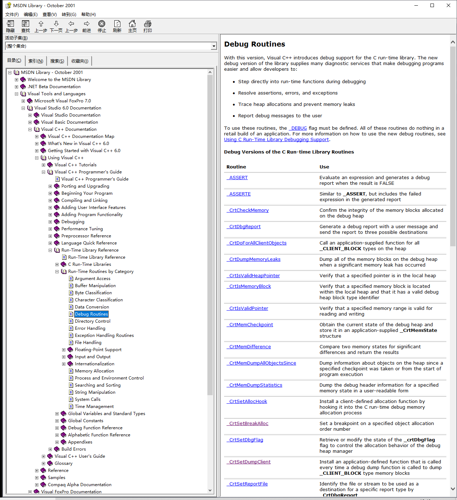

##### 堆结构

堆大小是内存分页大小（0x1000）的整倍数。

Debug版堆内存初始化为CD。

FEEE是空闲内存。

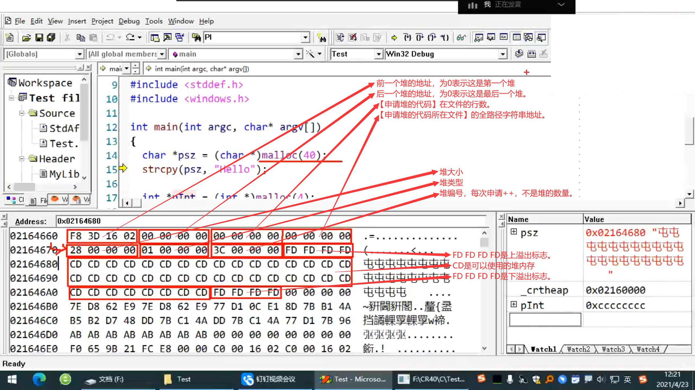

操作系统调用堆函数。

开头调用HeapCreate函数。

malloc函数调用HeapAlloc函数。

realloc函数调用HeapReAlloc函数。

free函数调用HeapFree函数。

结尾调用HeapDestroy函数。

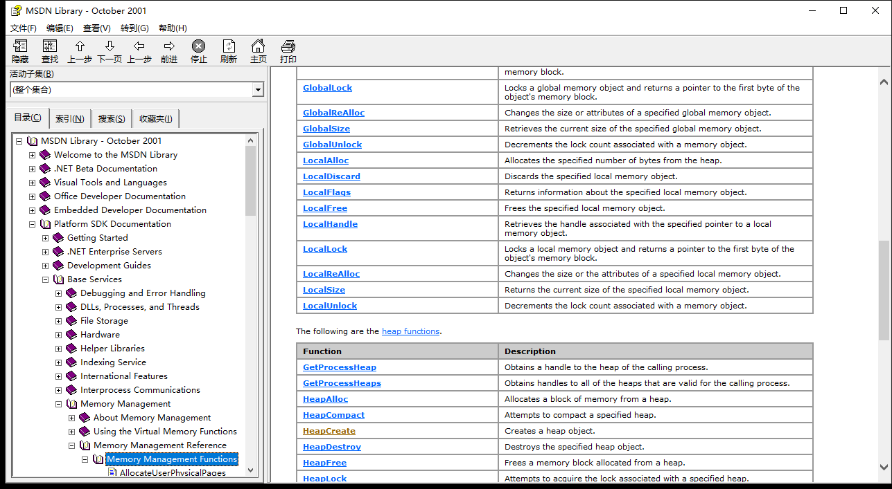

##### 使用内存断点定位bug位置

运行，弹窗，弹窗写着编号63的堆在地址0x007B4918出现bug。

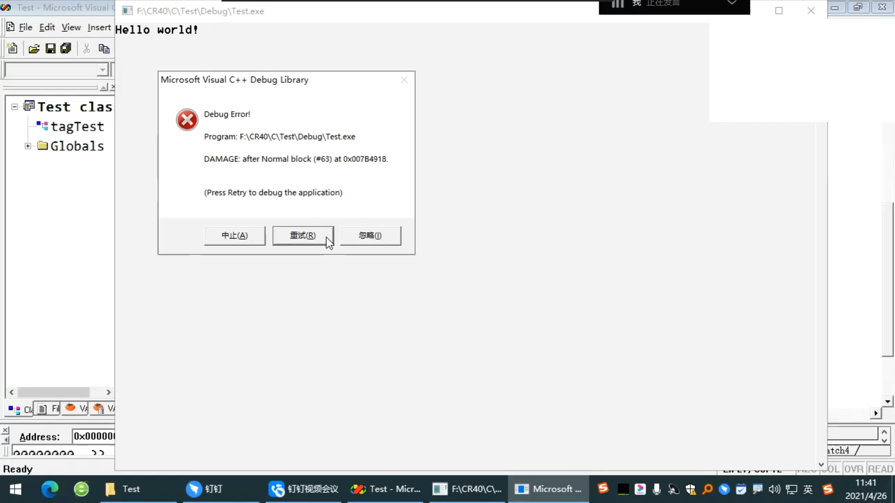

点击重试，打开函数栈窗口，从上往下找到自己写的的函数，点击函数，程序运行到绿色三角这行崩溃，在这行代码下断点，重新运行。

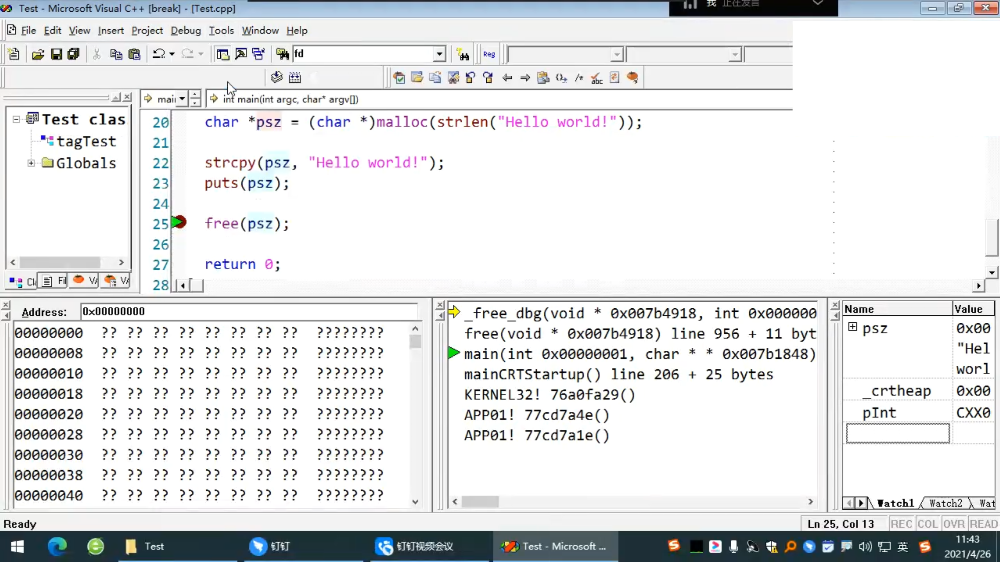

内存窗口转到指针指向的地址，发现堆内存的下溢出标志不完整。

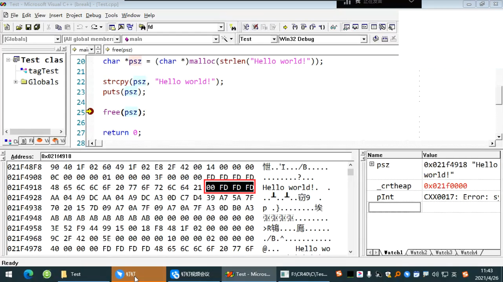

点击Edit→Breakpoints→Data→Enter the expression to be evaluated:→输入内存断点开始地址→Enter the number of elements to watch in an array or structure:→输入内存断点大小

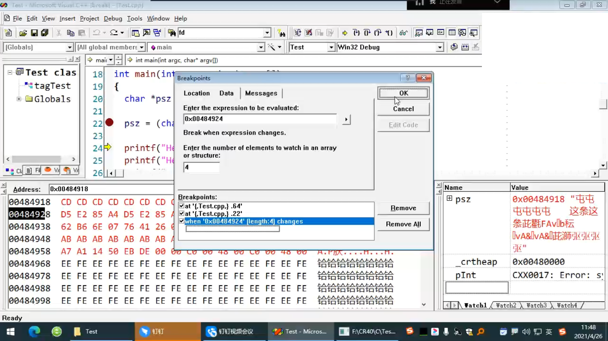

→OK。重新运行，程序暂停在strcpy函数，函数栈回溯到自己写的代码，找到bug原因。

##### VS2019设置内存断点

开始调试之后，调试→新建断点→数据断点。

##### 位运算

```
A and A     = A
A and not A = 0
A and 0     = 0
A and 1     = A

A or  A     = A
A and not A = 1
A or  0     = A
A or  1     = 1

A xor A     = 0
A xor not A = 1
A xor 0     = A
A xor 1     = not A

A xor B     = C
A xor C     = B
B xor C     = A
```

##### 位段

可以使用位段管理权限。

位段大小和结构成员对齐值无关。

使用同类型整型，不要瞎搞。

------

结构体成员按照【从上到下从低位到高位顺序】排列在使用的类型的内存上，如果某个结构体成员在剩余空间存不下，放弃当前对齐剩余的所有空间，从下一个对齐单位开始存放。

```c
#include <stdio.h>
#include <stdlib.h>

// 内存布局
// 0000D0DD 00CCCBBA
struct tagTest
{
    unsigned char A : 1;
    unsigned char B : 2;
    unsigned char C : 3;
    unsigned char D : 4;
};

int main()
{
    struct tagTest test = { 0 };

    printf("%p %d\r\n", &test, sizeof(struct tagTest)); // 0019FEDC 2

    // 使用全1值测试
    test.A = 0xFFFFFFFF;
    test.B = 0xFFFFFFFF;
    test.C = 0xFFFFFFFF;
    test.D = 0xFFFFFFFF;

    system("pause");
    return 0;
}
```

无名位段：没有名字，不能被引用，占着空间。

```c
#include <stdio.h>
#include <stdlib.h>

// 内存布局
// 0000D0DD 00CCC??A
struct tagTest
{
    unsigned char A : 1;
    unsigned char : 2;
    unsigned char C : 3;
    unsigned char D : 4;
};

int main()
{
    struct tagTest test = { 0 };

    printf("%p %d\r\n", &test, sizeof(struct tagTest)); // 0019FEDC 2

    // 使用全1值测试
    test.A = 0xFFFFFFFF;
    // test.B = 0xFFFFFFFF;
    test.C = 0xFFFFFFFF;
    test.D = 0xFFFFFFFF;

    system("pause");
    return 0;
}
```

零位段：放弃当前对齐剩余的所有空间，从下一个对齐单位开始存放。

```c
#include <stdio.h>
#include <stdlib.h>

// 内存布局
// 0000D0DD 00CCC00A
struct tagTest
{
    unsigned char A : 1;
    unsigned char : 0;
    unsigned char C : 3;
    unsigned char D : 4;
};

int main()
{
    struct tagTest test = { 0 };

    printf("%p %d\r\n", &test, sizeof(struct tagTest)); // 0019FEDC 2

    // 使用全1值测试
    test.A = 0xFFFFFFFF;
    // test.B = 0xFFFFFFFF;
    test.C = 0xFFFFFFFF;
    test.D = 0xFFFFFFFF;

    system("pause");
    return 0;
}
```

##### fopen、fseek、ftell、fread、fwrite、ffflush、close函数

file pointer：可以翻译成文件指针，我使用文件读写指针作为翻译。

FILE*：也可以翻译成文件指针，我使用FILE指针作为翻译。

```c
// 开文件
// 成功返回FILE指针，失败返回NULL
FILE* fopen(
    const char* filename, // 文件名字符串地址
    const char* mode	  // 打开模式字符串，rb+二进制打开存在文件，wb+二进制创建新文件
);

// 移动文件读写指针
// 成功返回0，失败返回非零值
int fseek(
    FILE* stream, // FILE指针
    long offset,  // 移动位移
    int origin	  // 移动起点，SEEK_SET文件开头，SEEK_CUR当前位置，SEEK_END文件结尾
);

// 获取文件读写指针相对文件开头位置
// 成功返回文件读写指针位置，失败返回-1
long ftell(
    FILE* stream // FILE指针
);

// 写文件
// 成功返回count
size_t fwrite(
    const void* buffer,	// 存放写入内容的地址
    size_t size,		// 写大小
    size_t count,		// 写几次，一般填1
    FILE* stream		// FILE指针
);

// 存文件
// 成功返回0，失败返回EOF
int fflush(
    FILE* stream // FILE指针
);

// 读文件
// 成功返回count
size_t fread(
    void* buffer, // 存放读出内容的地址
    size_t size,  // 读大小
    size_t count, // 读几次，一般填1
    FILE* stream  // FILE指针
);

// 关文件
// 成功返回0，失败返回EOF
int fclose(
    FILE* stream // FILE指针
);

#include <stdio.h>
fopen(filename, mode)
fseek(stream, offset, SEEK_SET)
ftell(stream)
fwrite(buffer, size, 1, stream)
fflush(stream)
fread(buffer, size, 1, stream)
fclose(stream)
```

如果有b就表示使用二进制模式打开，否则使用文本模式打开。

推荐使用二进制模式，不修改写入内容，可以写入数据块。

不使用文本模式，写入0x0A之前会自动写入0x0D。

| 打开文件模式 | 读   | 写   | 追加 | 先打开存在文件 | 后创建新文件 |
| ------------ | ---- | ---- | ---- | -------------- | ------------ |
| "rb"         | √    |      |      | √              | ×            |
| "wb"         |      | √    |      | ×              | √            |
| "ab"         |      |      | √    | √              | √            |
| "rb+"        | √    | √    |      | √              | ×            |
| "wb+"        | √    | √    |      | ×              | √            |
| "ab+"        | √    |      | √    | √              | √            |

```c
#include <stdio.h>
#include <stdlib.h>

int main()
{
    FILE* file = NULL;
    int nRet = 0;
    char sz[] = "Hello world!";
    long nFileSize = 0;
    char* pc = NULL;

    // 开文件
    file = fopen("Test.bin", "rb+");
    if (file == NULL)
    {
        // 创建文件
        file = fopen("Test.bin", "wb+");
        if (file == NULL)
        {
            printf("fopen失败\r\n");
            goto ERROR;
        }
    }

    // 移动文件读写指针到文件开头
    nRet = fseek(file, 0, SEEK_SET);
    if (nRet != 0)
    {
        printf("fseek失败\r\n");
        goto ERROR;
    }

    // 写文件
    nRet = fwrite(sz, sizeof(sz), 1, file);
    if (nRet < 0)
    {
        printf("fwrite失败\r\n");
        goto ERROR;
    }

    // 存文件
    nRet = fflush(file);
    if (nRet == EOF)
    {
        printf("fflush失败\r\n");
        goto ERROR;
    }

    // 移动文件读写指针到文件结尾
    nRet = fseek(file, 0, SEEK_END);
    if (nRet != 0)
    {
        printf("fseek失败\r\n");
        goto ERROR;
    }

    // 获取文件大小
    nFileSize = ftell(file);
    if (nFileSize == -1)
    {
        printf("ftell失败\r\n");
        goto ERROR;
    }

    // 申请堆内存
    pc = (char*)malloc(nFileSize);
    if (pc == NULL)
    {
        printf("malloc失败");
        goto ERROR;
    }

    // 移动文件读写指针带文件开头
    nRet = fseek(file, 0, SEEK_SET);
    if (nRet != 0)
    {
        printf("fseek失败\r\n");
        goto ERROR;
    }

    // 读文件
    nRet = fread(pc, nFileSize, 1, file);
    if (nRet < 0)
    {
        printf("fwrite失败\r\n");
        goto ERROR;
    }

    // 显示读入字符串
    printf("%s\r\n", pc);

    // 关文件
    if (file != NULL)
    {
        nRet = fclose(file);
        if (nRet == EOF)
        {
            printf("fclose失败\r\n");
        }
        file = NULL;
    }

    // 释放堆内存
    if (pc != NULL)
    {
        free(pc);
        pc = NULL;
    }

    system("pause");
    return 0;

ERROR:
    // 关文件
    if (file != NULL)
    {
        nRet = fclose(file);
        if (nRet == EOF)
        {
            printf("fclose失败\r\n");
        }
        file = NULL;
    }

    // 释放堆内存
    if (pc != NULL)
    {
        free(pc);
        pc = NULL;
    }

    system("pause");
    return -1;
}
```

##### 文件函数原理

打开VC++6.0，对着FILE类型按F12查看定义。

```c
#ifndef _FILE_DEFINED
struct _iobuf {
    char* _ptr;		 // 指针，指向当前文件位置，前面是已用空间，后面是剩余空间
    int   _cnt;		 // 缓存剩余大小
    char* _base;	 // 指向缓存开始位置，在堆中
    int   _flag;	 // 当前文件状态
    int   _file;	 // 文件号，是数组下标
    int   _charbuf;	 // 
    int   _bufsiz;	 // 缓存总大小
    char* _tmpfname; // 
};
typedef struct _iobuf FILE;
#define _FILE_DEFINED
#endif
```

对着fopen函数按F12查看定义。

根据打开模式字符串设置属性，最后显示在_flag。

调用WINAPI的CreateFile函数。

返回一个全局FILE类型数组_iob的地址。

文件函数在第一次读写时创建缓存。

每次读写缓存，计算数据大小，和缓存剩余大小比较，如果存得下就直接存缓存，如果存不下就强制缓存存文件。

之后不清理缓存，而是ptr回到缓存开头，开始存放数据。

C文件函数和WINAPI效率不一定谁高。

在关文件时存文件。

##### 其他文件函数

fprintf和fputs函数的stream参数填stdout，相当于printf函数。

```c
// 写格式化字符串，不会添加其他字符
// 成功返回写入字节数，失败返回负数
int fprintf(
    FILE* stream,					  // FILE指针
    const char* format[, argument]... // 格式化字符串地址，和printf相同
);

// 写字符串，不会添加其他字符
// 成功返回非负数，失败返回EOF
int fputs(
    const char* string,	// 字符串地址，和puts相同
    FILE* stream		// FILE指针
);

int fgetc(FILE* stream);
int fputc(int c, FILE* stream);
char* fgets(char* string, int n, FILE* stream);
int fscanf(FILE* stream, const char* format[, argument]...);
int feof(FILE* stream);
int ferror(FILE* stream);

#include <stdio.h>
fprintf(stream, format)
fputs(cstring, stream)
```

```c
#include <stdio.h>
#include <stdlib.h>

int main()
{
    FILE* file = NULL;
    int nRet = 0;

    // 开文件
    file = fopen("Test.bin", "rb+");
    if (file == NULL)
    {
        // 创建文件
        file = fopen("Test.bin", "wb+");
        if (file == NULL)
        {
            printf("fopen失败\r\n");
            goto ERROR;
        }
    }

    // fprintf写文件
    nRet = fprintf(file, "ABC");
    if (nRet < 0)
    {
        printf("fprintf失败\r\n");
        goto ERROR;
    }
    else
    {
        printf("fprintf写入%d个字符\r\n", nRet);
    }

    // fputs写文件
    nRet = fputs("DEF", file);
    if (nRet == EOF)
    {
        printf("fputs失败\r\n");
        goto ERROR;
    }

    // 存文件
    nRet = fflush(file);
    if (nRet == EOF)
    {
        printf("fflush失败\r\n");
        goto ERROR;
    }

    // 关文件
    if (file != NULL)
    {
        nRet = fclose(file);
        if (nRet == EOF)
        {
            printf("fclose失败\r\n");
        }
        file = NULL;
    }

    system("pause");
    return 0;

ERROR:
    // 关文件
    if (file != NULL)
    {
        nRet = fclose(file);
        if (nRet == EOF)
        {
            printf("fclose失败\r\n");
        }
        file = NULL;
    }

    system("pause");
    return -1;
}
```

##### 加密解密流程

加密算法源码公开，仍然只能暴力破解。

不加密已知的东西，比如函数头、\0。

需求＞保护。

碰撞：一个哈希值对应多个明文。


###### 加密流程

现在有Account、Password、Code。

Key = Account和Password进行运算。

EnCode = Code和Key进行可逆运算。

CheckValue = Code进行不可逆运算，常用MD5算法。

简略演示，数组必须使用unsigned char类型。

```c
#include <stdio.h>
#include <string.h>
#include <stdlib.h>

int main()
{
    unsigned char szAccount[] = "123";
    unsigned char szPassword[] = "456";
    unsigned char szCode[] = "Hello world!";
    unsigned char szKey[16] = { 0 };
    unsigned char szEnCode[16] = { 0 };
    int nCheckValue = 0;

    // Key = Account和Password进行运算
    strcpy(szKey, szAccount);
    strcat(szKey, szPassword);

    // EnCode = Code和Key进行可逆运算
    for (int i = 0; i < sizeof(szCode) / sizeof(szCode[0]); i++)
    {
        szEnCode[i] = szCode[i] ^ szKey[i % strlen(szKey)];
    }

    // CheckValue = Code进行不可逆运算
    for (int i = 0; i < sizeof(szCode) / sizeof(szCode[0]); i++)
    {
        nCheckValue = nCheckValue + szCode[i];
    }

    printf("szAccount   %s\r\n", szAccount);
    printf("szPassword  %s\r\n", szPassword);
    printf("szCode      { ");
    for (int i = 0; i < sizeof(szCode) / sizeof(szCode[0]); i++)
    {
        printf("0x%02X,", szCode[i]);
    }
    printf("\b }\r\n");
    printf("szCode      %s\r\n", szCode);
    printf("szKey       %s\r\n", szKey);
    printf("szEnCode    { ");
    for (int i = 0; i < sizeof(szCode) / sizeof(szCode[0]); i++)
    {
        printf("0x%02X,", szEnCode[i]);
    }
    printf("\b }\r\n");
    printf("nCheckValue %d\r\n", nCheckValue);

    system("pause");
    return 0;
}

// szAccount   123
// szPassword  456
// szCode      { 0x48,0x65,0x6C,0x6C,0x6F,0x20,0x77,0x6F,0x72,0x6C,0x64,0x21,0x00 }
// szCode      Hello world!
// szKey       123456
// szEnCode    { 0x79,0x57,0x5F,0x58,0x5A,0x16,0x46,0x5D,0x41,0x58,0x51,0x17,0x31 }
// nCheckValue 1117
```

###### 解密流程

现在有EnCode、CheckValue。

输入一个InputAccount。

输入一个InputPassword。

InputKey = InputAccount和InputPassword进行运算。

DeCode = EnCode和InputKey进行可逆运算。

InputCheckValue = DeCode进行不可逆运算。

如果InputCheckValue == CheckValue，就输出解密成功，使用DeCode。

简略演示，数组必须使用unsigned char类型。

```c
#include <stdio.h>
#include <string.h>
#include <stdlib.h>

int main()
{
    unsigned char szEnCode[] = { 0x79,0x57,0x5F,0x58,0x5A,0x16,0x46,0x5D,0x41,0x58,0x51,0x17,0x31 };
    int nCheckValue = 1117;

    unsigned char szInputAccount[] = "123";
    unsigned char szInputPassword[] = "456";
    unsigned char szInputKey[16] = { 0 };
    unsigned char szDeCode[16] = { 0 };
    int nInputCheckValue = 0;

    // InputKey = InputAccount和InputPassword进行运算
    strcpy(szInputKey, szInputAccount);
    strcat(szInputKey, szInputPassword);

    // DeCode = EnCode和InputKey进行可逆运算
    for (int i = 0; i < sizeof(szEnCode) / sizeof(szEnCode[0]); i++)
    {
        szDeCode[i] = szEnCode[i] ^ szInputKey[i % strlen(szInputKey)];
    }

    // InputCheckValue = DeCode进行不可逆运算
    for (int i = 0; i < sizeof(szDeCode) / sizeof(szDeCode[0]); i++)
    {
        nInputCheckValue = nInputCheckValue + szDeCode[i];
    }

    printf("szEnCode         { ");
    for (int i = 0; i < sizeof(szEnCode) / sizeof(szEnCode[0]); i++)
    {
        printf("0x%02X,", szEnCode[i]);
    }
    printf("\b }\r\n");
    printf("nCheckValue      %d\r\n", nInputCheckValue);
    printf("szInputAccount   %s\r\n", szInputAccount);
    printf("szInputPassword  %s\r\n", szInputPassword);
    printf("szInputKey       %s\r\n", szInputKey);
    printf("szDeCode         { ");
    for (int i = 0; i < strlen(szDeCode) + 1; i++)
    {
        printf("0x%02X,", szDeCode[i]);
    }
    printf("\b }\r\n");
    printf("szDeCode         %s\r\n", szDeCode);
    printf("nInputCheckValue %d\r\n", nInputCheckValue);
    if (nCheckValue == nInputCheckValue)
    {
        printf("Decryption success\r\n");
    }

    system("pause");
    return 0;
}

// szEnCode         { 0x79,0x57,0x5F,0x58,0x5A,0x16,0x46,0x5D,0x41,0x58,0x51,0x17,0x31 }
// nCheckValue      1117
// szInputAccount   123
// szInputPassword  456
// szInputKey       123456
// szDeCode         { 0x48,0x65,0x6C,0x6C,0x6F,0x20,0x77,0x6F,0x72,0x6C,0x64,0x21,0x00 }
// szDeCode         Hello world!
// nInputCheckValue 1117
// Decryption success
```

##### PPT水平层次结构

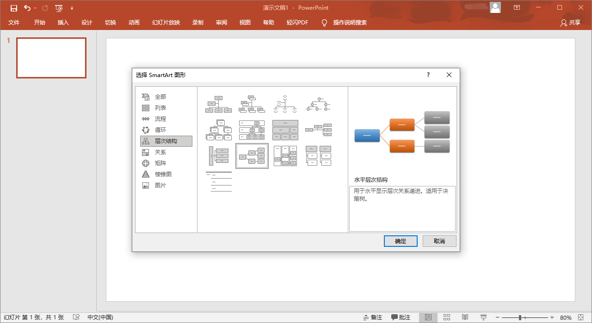

##### 作业

1

计算进制转换。

随机点名。

安装VC++6.0、MSDN本地版、WinHex、文本编辑器、虚拟机。

2

计算进制转换。

打印ASCII码表，观察关系。

观察不同类型变量的内存。

3

画菱形。

逆向分析switch-case。

大数阶乘。

4

使用goto实现循环。

5

分析函数调用过程。

CrackMe。

6

使用数组定位程序入口点。

回文。

使用循环实现走迷宫。

7

折半查找。

8

使用数组访问内存。

9

string库函数。

内存管理项目。

10

使用静态局部变量实现累加。

11

多字节和Unicode双编码版俄罗斯方块。

12

输出main函数栈空间。

string库函数。

13

string库函数。

14

使用函数指针输出Hello world!函数的16进制。

16进制数据B8 23 01 00 00 C3作为无参函数运行，输出10进制返回值。

幻方。

string库函数。

15

计算结构体成员偏移。

分别使用指针和结构体本身，遍历输出结构体数组。

16

Pascal字符串。

变体。

17

遍历输出堆信息。

18

使用位域解析浮点数编码格式

磁盘管理项目。

##### 项目总结

###### 内存管理项目

分离业务算法界面。

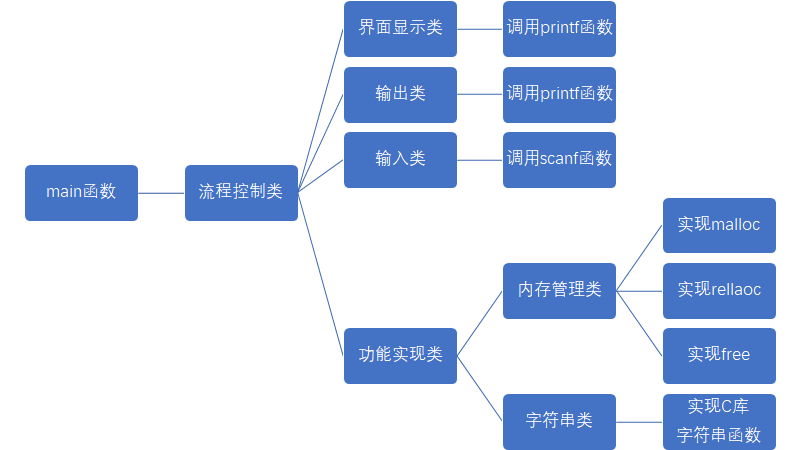

main.c文件是程序入口。

界面显示函数可以传入界面编号，使用界面编号当作下表访问字符串指针数组，字符串指针指向要显示的界面字符串。

输出使用printf函数%s参数。

输入使用scanf函数和正则表达式。

字符串存储\0结束符。

模拟堆的双向链表设计。

按照要求写文档。

###### 磁盘管理项目

按照内存管理项目修改。

修改功能实现函数，内存管理函数修改为磁盘管理函数。

增加重置文件功能。

封装宏，检查指针。
